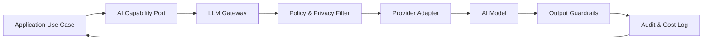

# LLM Gateway Architecture

El LLM Gateway es la puerta única para consumo de modelos generativos.

## Responsabilidades

- Aplicar políticas de privacidad.
- Resolver proveedor/modelo según tenant, licencia, país y caso de uso.
- Registrar auditoría y costo.
- Aplicar guardrails.
- Ejecutar fallback.
- Estandarizar respuestas.

## Flujo

