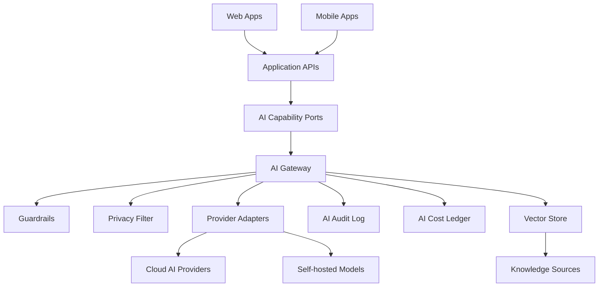

# AI Platform Context View

```mermaid
flowchart TB
  Web[Web Apps] --> API[Application APIs]
  Mobile[Mobile Apps] --> API
  API --> AIPort[AI Capability Ports]
  AIPort --> Gateway[AI Gateway]
  Gateway --> Guardrails[Guardrails]
  Gateway --> Privacy[Privacy Filter]
  Gateway --> Provider[Provider Adapters]
  Provider --> Cloud[Cloud AI Providers]
  Provider --> Local[Self-hosted Models]
  Gateway --> Audit[AI Audit Log]
  Gateway --> Cost[AI Cost Ledger]
  Gateway --> Vector[Vector Store]
  Vector --> Knowledge[Knowledge Sources]
```
