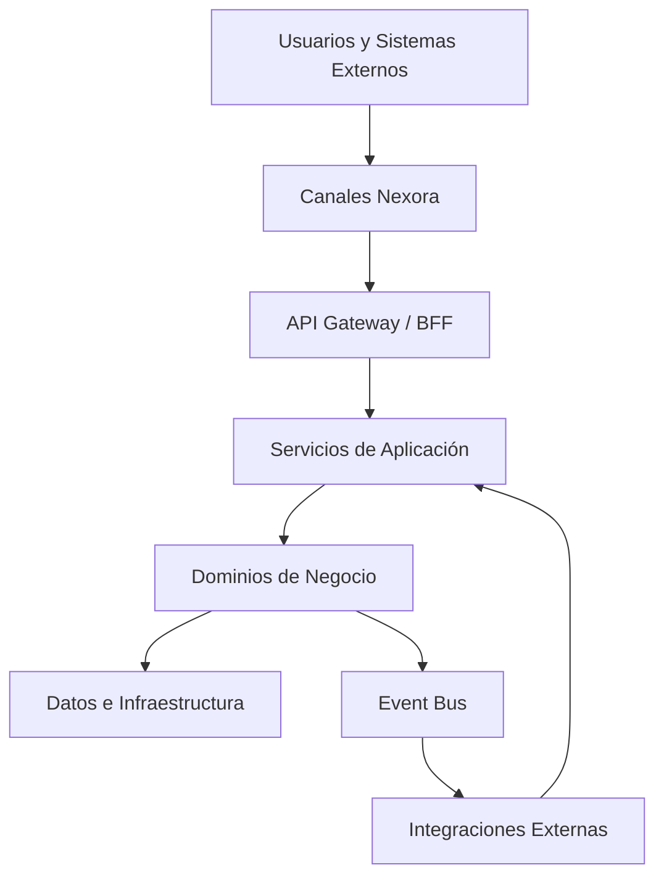

# Application Architecture Baseline

**ID:** APP-ARCH-001  
**Estado:** Approved  
**Versión:** 0.17.0  
**Owner:** Enterprise Architecture

## Propósito

Definir la capa de aplicaciones de Nexora para conectar capacidades de negocio, dominios DDD, canales de usuario, APIs, integraciones y unidades desplegables.

Nexora no debe construirse como una colección de CRUDs aislados. Debe construirse como un ecosistema de aplicaciones que comparten capacidades, reglas y contratos.

## Vista conceptual

## Aplicaciones principales

| ID | Aplicación | Propósito |
|---|---|---|
| APP-001 | Nexora Public Website | Captación, información, SEO, cotizaciones públicas y acceso a portales. |
| APP-002 | Nexora Admin Portal | Operación interna para empleados, laboratorios, sucursales, caja, resultados e inventario. |
| APP-003 | Nexora Patient Portal | Consulta de resultados, citas, pagos, facturas y comunicación con el laboratorio. |
| APP-004 | Nexora Doctor Portal | Consulta de pacientes referidos, resultados, historial y solicitudes de estudios. |
| APP-005 | Nexora Mobile Patient App | Experiencia móvil para pacientes con bajo consumo y capacidades progresivas. |
| APP-006 | Nexora Mobile Doctor App | Acceso móvil para médicos, notificaciones y seguimiento. |
| APP-007 | Nexora Public API | API para integraciones externas, partners, marketplace y ecosistema. |
| APP-008 | Nexora Integration Gateway | Capa de interoperabilidad ASTM, HL7, FHIR, DICOM, SFTP, webhooks y REST. |
| APP-009 | Nexora AI Assistant Layer | Capacidades IA reutilizables para recepción, médicos, pacientes y operación. |
| APP-010 | Nexora Analytics Console | Dashboards, KPIs, BI y analítica ejecutiva. |

## Capas de aplicación

### 1. Experience Layer
Incluye web, mobile, portales y consola administrativa. No contiene reglas críticas de negocio.

### 2. API/BFF Layer
Expone contratos estables para cada experiencia. Puede adaptar respuestas para web/mobile sin duplicar reglas del dominio.

### 3. Application Service Layer
Orquesta casos de uso, validaciones de aplicación, transacciones, políticas de permisos y publicación de eventos.

### 4. Domain Layer
Contiene reglas de negocio, agregados, entidades, value objects y eventos de dominio.

### 5. Infrastructure Layer
Implementa persistencia, mensajería, almacenamiento, identidad, proveedores externos y observabilidad.

## Reglas de arquitectura

- Ningún canal accede directamente a la base de datos.
- Ningún canal implementa reglas clínicas, fiscales o de negocio críticas.
- Todo endpoint público debe tener contrato OpenAPI.
- Todo evento de dominio debe estar documentado y versionado.
- Toda aplicación debe soportar i18n desde el diseño.
- Las aplicaciones deben degradar capacidades avanzadas de forma progresiva en dispositivos modestos.
- Las funciones IA deben tener fallback funcional sin IA cuando aplique.
