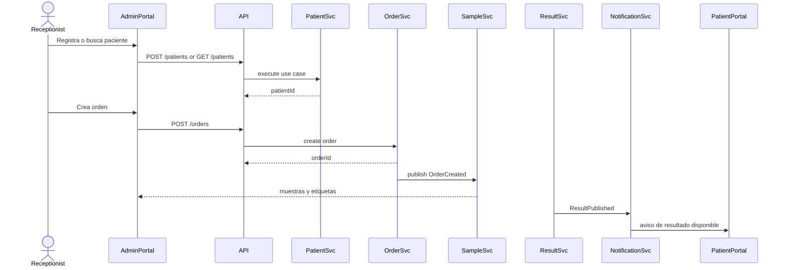

# Patient → Order → Sample → Result Application Flow

**ID:** APP-FLOW-001  
**Estado:** Draft  
**Versión:** 0.17.0

## Flujo lógico

## Eventos involucrados

- PatientRegistered
- PatientUpdated
- OrderCreated
- SampleLabelGenerated
- SampleCollected
- SampleRejected
- ResultCaptured
- ResultValidated
- ResultPublished
- PatientNotified

## APIs involucradas

- Patients API
- Orders API
- Samples API
- Results API
- Notifications API

## Reglas

- Una orden no puede crearse sin paciente válido.
- Las muestras deben tener trazabilidad desde su generación hasta el resultado.
- Un resultado no puede publicarse sin validación/firma cuando la prueba lo requiera.
- La notificación no debe revelar datos clínicos sensibles fuera de canales seguros.
