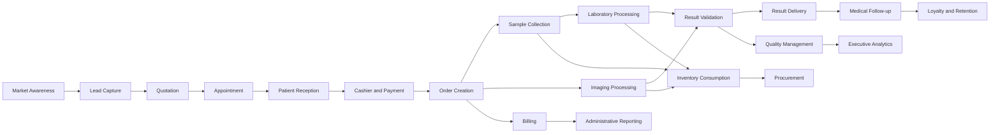

# Nexora Enterprise Value Chain

Nexora supports the complete operational chain of a diagnostic healthcare organization.

## Primary Value Streams

| ID | Value Stream | Purpose |
|---|---|---|
| VS-001 | Patient Acquisition | Convert digital and offline interest into scheduled services. |
| VS-002 | Patient Attention | Receive the patient, confirm identity, collect payment and create the diagnostic order. |
| VS-003 | Diagnostic Execution | Perform laboratory and imaging services with traceability and quality control. |
| VS-004 | Result Management | Validate, sign, publish and deliver clinical results. |
| VS-005 | Administrative Management | Manage billing, inventory, purchases, cash control and reporting. |
| VS-006 | Quality and Compliance | Ensure traceability, auditability, compliance and operational quality. |
| VS-007 | Intelligence and Optimization | Use analytics and AI to improve operations, service quality and decision-making. |

## Design Rule

Every functional module must be linked to at least one value stream and one business capability.
