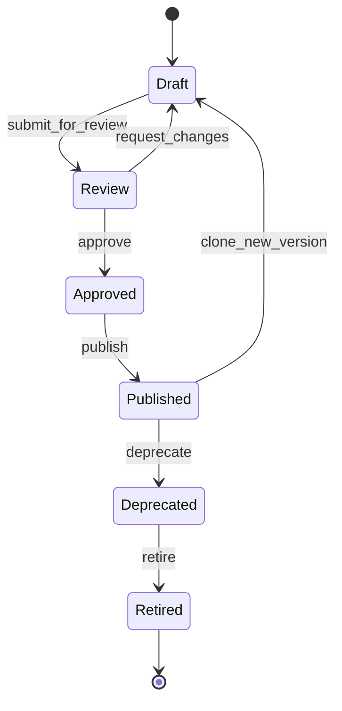
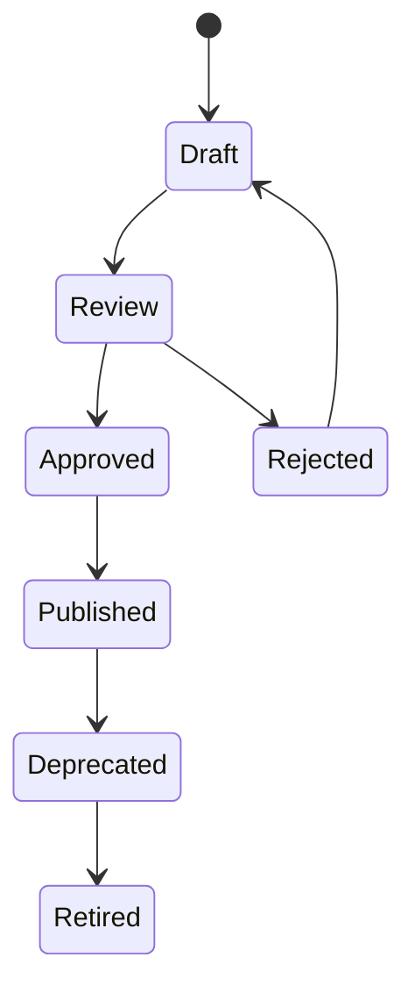
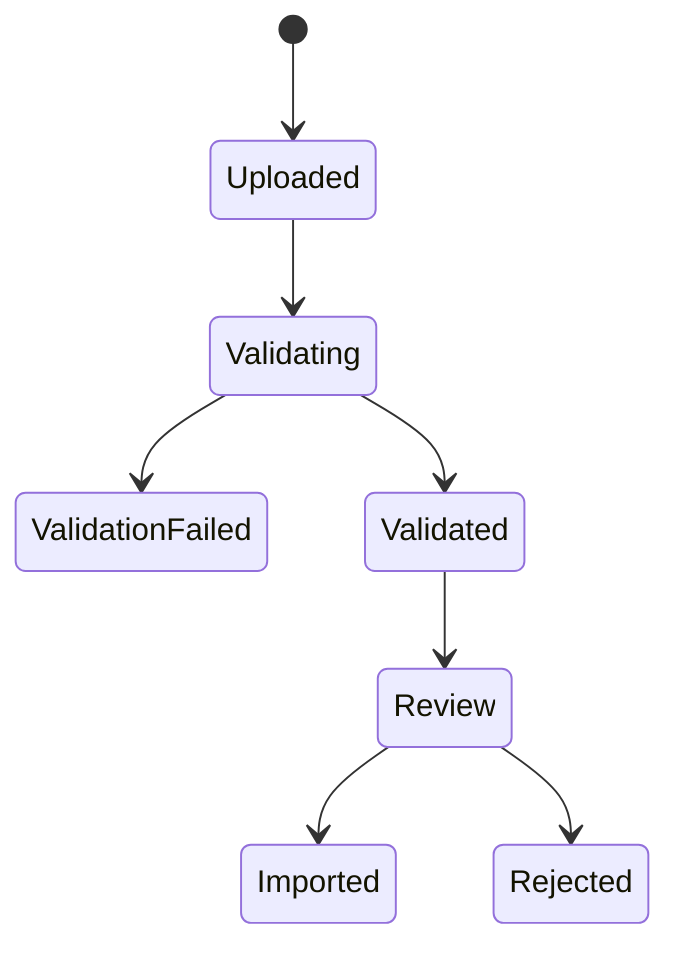
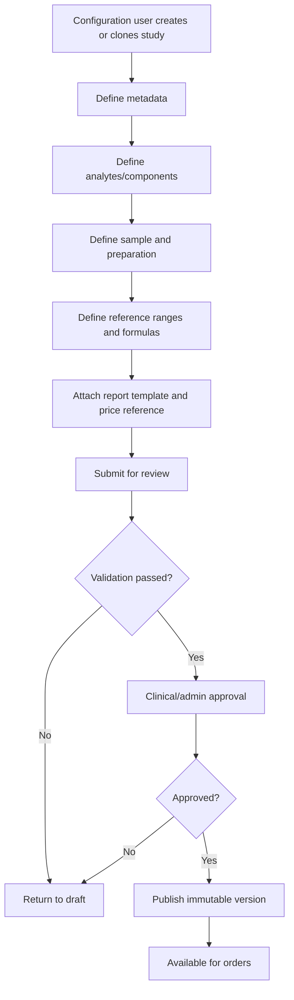

# CAP-005 Catalog & Test Configuration Management

## Purpose

Catalog & Test Configuration Management is the Nexora capability responsible for defining, versioning and governing the master catalogs, clinical studies, test panels, individual analytes, reference ranges, patient preparation instructions, prices, sample requirements, labels and report templates used by diagnostic operations.

This capability prevents hardcoded laboratory logic. It enables Nexora to support different laboratories, branches, countries, commercial plans, medical specialties and reporting formats through configuration instead of custom development.

## Business Outcomes

- Configure laboratory and imaging services without code changes.
- Standardize studies, tests, analytes, units and reference values.
- Support reusable catalogs across laboratories while allowing tenant-specific overrides.
- Enable safe versioning of clinical configuration.
- Prevent active clinical orders from being affected by uncontrolled catalog changes.
- Provide configuration metadata for orders, sample collection, results, billing, reports, inventory and patient portals.
- Support multilingual names, descriptions and preparation instructions.
- Support future marketplace, country packs and healthcare packs.

## Scope

### Included

- Master catalog administration.
- Study, panel, package and analyte configuration.
- Sample type, container, tube, label and preparation configuration.
- Reference ranges by age, sex, pregnancy, branch, method, equipment and unit.
- Result fields, formulas and calculated parameters.
- Report template configuration.
- Price list and price version references.
- Configuration lifecycle, approval and publishing.
- Tenant and branch override strategy.
- Import/export of catalogs.
- Auditability and rollback of configurations.

### Excluded from this capability

- Creating orders for patients. Covered by Order Management.
- Capturing clinical results. Covered by Results & Reporting.
- Managing reagent inventory. Covered by Inventory Management.
- Billing and CFDI/local tax invoicing. Covered by Billing & Country Packs.

## Dependencies

- CAP-002 Organization & Branch Management.
- CAP-003 Identity, Access & Workforce Management.
- CAP-004 Medical Staff & Referring Physicians Management.
- Data Architecture and Master Data Management.
- Security & Compliance Architecture.

## Enables

- Order Management.
- Sample Collection.
- Laboratory Operations.
- Imaging Operations.
- Results & Reporting.
- Billing and Cashier.
- Patient and Doctor Portals.
- AI-assisted reception and interpretation.

## Configuration Philosophy

Nexora must never require source code changes to add a standard laboratory study, modify a reference range, add a sample requirement, translate preparation instructions or publish a new report layout. These actions must be performed through governed configuration workflows with approval, audit and version control.

## Lifecycle

## Core Concepts

| Concept | Description |
|---|---|
| Catalog | A governed list of values or definitions used by Nexora. |
| Study | A sellable diagnostic service such as glucose, complete blood count, chest X-ray or ultrasound. |
| Panel | A study composed of multiple analytes or components. |
| Analyte | A measurable or reportable result component. |
| Reference Range | Expected value interval configured by demographic, clinical or method criteria. |
| Sample Requirement | Required sample type, container, volume and handling instruction. |
| Preparation Instruction | Patient-facing preparation rule before the study. |
| Report Template | Structured layout used to render results. |
| Price Reference | Link between a study and a price list/version. |
| Configuration Version | Immutable published snapshot used by orders and results. |

## Business Rules

| ID | Rule |
|---|---|
| BR-CAT-001 | A published configuration version must be immutable. |
| BR-CAT-002 | Active orders must continue using the configuration version active at the time of order creation. |
| BR-CAT-003 | A study cannot be published without at least one valid name, category, sample requirement or imaging modality when applicable. |
| BR-CAT-004 | A clinical analyte must define unit, data type and result interpretation behavior before publication. |
| BR-CAT-005 | Reference ranges must include effective dates and must not overlap for the same applicability criteria. |
| BR-CAT-006 | Any formula-based analyte must declare dependencies on other analytes. |
| BR-CAT-007 | A formula cannot be published if it references inactive or unpublished analytes. |
| BR-CAT-008 | Patient preparation instructions must support localization for configured languages. |
| BR-CAT-009 | A branch override cannot weaken mandatory clinical safety rules defined by the tenant/global configuration. |
| BR-CAT-010 | Only authorized users with configuration approval permission may publish catalog changes. |
| BR-CAT-011 | Every catalog change must create an audit event with old value, new value, author, reason and timestamp. |
| BR-CAT-012 | Retired studies cannot be selected for new orders but must remain visible for historical records. |
| BR-CAT-013 | A report template must be compatible with the study result schema before publication. |
| BR-CAT-014 | A price reference must point to an active price list version before a study is sellable. |
| BR-CAT-015 | Imported catalog data must be validated before being promoted to review. |

## Decision Tables

### Study publish eligibility

| Condition | Draft complete | Safety validation | Pricing ready | Approval present | Result |
|---|---:|---:|---:|---:|---|
| New study complete | Yes | Passed | Yes | Yes | Publish allowed |
| Missing sample/preparation | No | N/A | Any | Any | Publish denied |
| Formula invalid | Yes | Failed | Any | Any | Publish denied |
| No price configured | Yes | Passed | No | Yes | Publish as non-sellable only |
| No approval | Yes | Passed | Yes | No | Publish denied |

### Reference range selection

| Age match | Sex match | Method match | Branch override | Effective date | Selected range |
|---:|---:|---:|---:|---:|---|
| Yes | Yes | Yes | Yes | Yes | Branch-specific range |
| Yes | Yes | Yes | No | Yes | Tenant/global range |
| Yes | Any | Yes | No | Yes | Generic sex-independent range |
| No | Any | Any | Any | Any | No range; flag for manual review |

## State Machines

### Study Configuration State

### Catalog Import State

## BPMN Textual Flow

## Event Storming

| Event ID | Event |
|---|---|
| EVT-CAT-001 | CatalogCreated |
| EVT-CAT-002 | CatalogValueAdded |
| EVT-CAT-003 | StudyConfigurationCreated |
| EVT-CAT-004 | StudyConfigurationSubmittedForReview |
| EVT-CAT-005 | StudyConfigurationApproved |
| EVT-CAT-006 | StudyConfigurationPublished |
| EVT-CAT-007 | StudyConfigurationDeprecated |
| EVT-CAT-008 | ReferenceRangeConfigured |
| EVT-CAT-009 | FormulaValidated |
| EVT-CAT-010 | ReportTemplateLinked |
| EVT-CAT-011 | PriceReferenceLinked |
| EVT-CAT-012 | CatalogImportValidated |
| EVT-CAT-013 | CatalogImportRejected |

## DDD Model

### Aggregate Roots

- CatalogDefinition
- StudyConfiguration
- ReferenceRangeSet
- ReportTemplateDefinition
- PriceListReference
- CatalogImportBatch

### Entities

- CatalogValue
- StudyVersion
- StudyComponent
- AnalyteDefinition
- SampleRequirement
- PreparationInstruction
- ReferenceRange
- FormulaDefinition
- ResultFieldDefinition
- TemplateSection
- LocalizationEntry
- BranchOverride

### Value Objects

- CatalogCode
- StudyCode
- EffectivePeriod
- LocaleCode
- UnitOfMeasure
- MeasurementMethod
- DemographicCriteria
- FormulaExpression
- ApprovalDecision
- VersionNumber

## Commands

| Command | Description |
|---|---|
| CreateCatalogDefinition | Creates a governed catalog. |
| AddCatalogValue | Adds a value to a catalog. |
| CreateStudyConfiguration | Creates a draft study configuration. |
| CloneStudyConfigurationVersion | Creates a new draft based on a published version. |
| ConfigureStudyComponent | Adds or modifies analytes/components. |
| ConfigureReferenceRange | Adds demographic/method-based reference values. |
| ValidateFormula | Validates calculated analytes. |
| SubmitStudyForReview | Moves configuration to review. |
| ApproveStudyConfiguration | Approves the study configuration. |
| PublishStudyConfiguration | Publishes immutable version. |
| DeprecateStudyConfiguration | Prevents new usage while preserving history. |
| ImportCatalogBatch | Imports catalog definitions from a file. |

## Queries

| Query | Description |
|---|---|
| GetCatalogDefinitions | Lists catalog definitions. |
| SearchCatalogValues | Searches active catalog values. |
| GetStudyConfiguration | Gets a study with components and versions. |
| SearchSellableStudies | Lists studies available for order creation. |
| GetReferenceRangesForAnalyte | Resolves ranges based on criteria. |
| GetStudyPreparationInstructions | Gets patient-facing preparation text. |
| GetStudyReportSchema | Gets result/report schema for a study. |
| GetConfigurationAuditTrail | Gets configuration audit history. |

## User Stories

| ID | Story |
|---|---|
| US-CAT-001 | As a laboratory administrator, I want to create master catalogs so that values are standardized across branches. |
| US-CAT-002 | As a configuration user, I want to create a study definition so that it can later be ordered for patients. |
| US-CAT-003 | As a clinical user, I want to define analytes for a study so that results can be captured consistently. |
| US-CAT-004 | As a clinical user, I want to configure reference ranges by age and sex so that reports show correct interpretation. |
| US-CAT-005 | As a laboratory administrator, I want to configure sample requirements so that reception and phlebotomy know what to collect. |
| US-CAT-006 | As a patient, I want preparation instructions in my language so that I can arrive correctly prepared. |
| US-CAT-007 | As a supervisor, I want to approve catalog changes before publication so that unsafe configurations are prevented. |
| US-CAT-008 | As an auditor, I want to see who changed a study configuration so that configuration changes are traceable. |
| US-CAT-009 | As a cashier, I want only sellable active studies to appear in the order screen so that obsolete studies are not sold. |
| US-CAT-010 | As a result validator, I want result fields to follow the configured schema so that reports are consistent. |
| US-CAT-011 | As a branch manager, I want allowed branch overrides so that local operational differences can be represented. |
| US-CAT-012 | As a product owner, I want catalog import/export so that onboarding laboratories is faster. |

## OpenAPI Scope

The Catalogs API and Test Configuration API must expose contract-first endpoints for catalogs, catalog values, study configurations, versions, analytes, reference ranges, preparation instructions, report schemas, approvals and publication.

## Web UX Scope

- Catalog dashboard.
- Study configuration editor.
- Analyte/component editor.
- Reference range matrix editor.
- Formula validation panel.
- Preparation instruction editor with localization.
- Approval queue.
- Version history viewer.
- Import/export wizard.

## Mobile UX Scope

Mobile must prioritize read-only operational use for MVP:

- Search active studies.
- View patient preparation instructions.
- View sample requirements.
- View study metadata for reception/sample collection.

Full configuration authoring is not required on low-resource mobile devices for MVP.

## AI Use Cases

- Suggest study metadata from imported catalogs.
- Detect duplicate or similar study definitions.
- Assist in translating preparation instructions.
- Explain configuration validation errors.
- Detect potentially overlapping reference ranges.
- Suggest report template structure from analyte definitions.

AI suggestions must never publish clinical configuration automatically.

## QA Strategy

- Contract tests from OpenAPI.
- Rule tests for publish eligibility.
- Decision table tests for reference range selection.
- State transition tests.
- Permission tests for approvals and publication.
- Regression tests for immutable published versions.
- Import validation tests.

## KPIs

- Average time to configure a new study.
- Percentage of studies with complete sample/preparation metadata.
- Number of rejected configurations by reason.
- Catalog duplication rate.
- Configuration publication lead time.
- Configuration rollback count.

## Compliance Notes

- Clinical configuration changes are auditable events.
- Published versions are immutable for historical traceability.
- Patient-facing instructions must be versioned by locale.
- Result interpretation configuration must preserve effective dates.

## Traceability

| Artifact | IDs |
|---|---|
| Capability | CAP-005 |
| Rules | BR-CAT-001 to BR-CAT-015 |
| Events | EVT-CAT-001 to EVT-CAT-013 |
| API | API-CAT-001, API-TCFG-001 |
| Entities | ENT-CAT-001 to ENT-CAT-018 |
| Stories | US-CAT-001 to US-CAT-012 |
| Agent | AGENT-CAT-001 |
