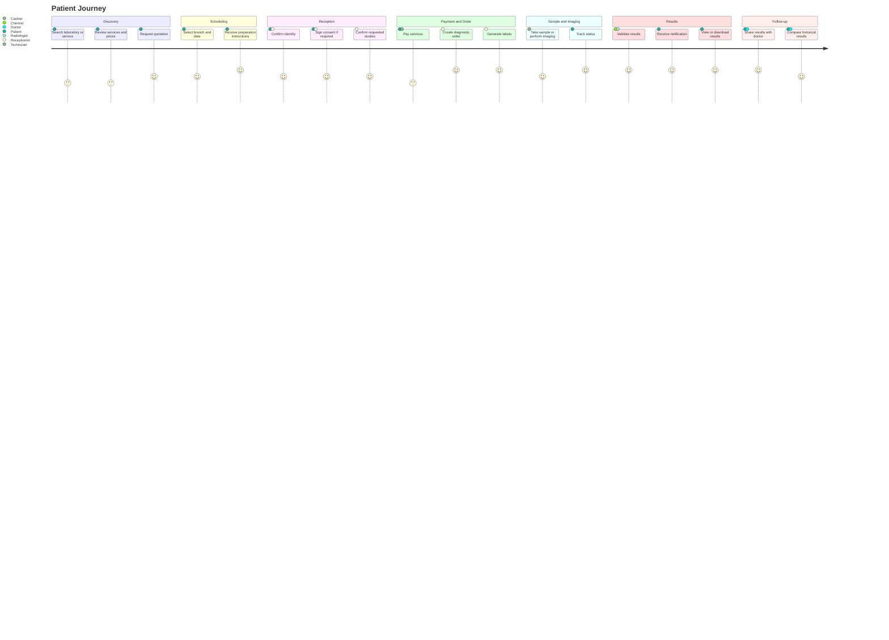

# Patient Journey

The Patient Journey describes the end-to-end experience from discovering Nexora-enabled diagnostic services to receiving results and follow-up.

## User Goals

- Understand what service is needed.
- Know price, location, preparation instructions and expected delivery time.
- Avoid duplicate data entry.
- Receive clear and timely notifications.
- Access results securely from web or mobile, including low-resource devices.
- Share results with doctors when authorized.

## Business Goals

- Increase conversion from quotation to order.
- Reduce reception time.
- Reduce sample and result traceability errors.
- Improve patient satisfaction.
- Enable self-service through patient portal and mobile app.
- Preserve auditability and consent records.

## Experience Levels

| Level | Description |
|---|---|
| Core | Registration, order, payment, sample, result access. |
| Enhanced | Online scheduling, preparation instructions, notifications, historical comparison. |
| Intelligent | AI-assisted preparation guidance, result explanation and proactive follow-up, always with clinical safety controls. |
