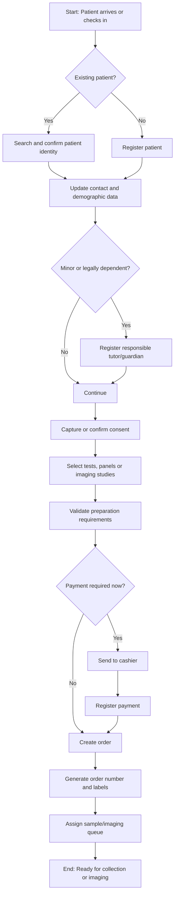

# Patient Intake Process

This process starts when a patient arrives at a branch or begins digital check-in and ends when the diagnostic order is ready for sample collection or imaging.

## Roles

- Patient.
- Receptionist.
- Cashier.
- Sample Collection Technician.
- Branch Supervisor.

## Key Rules

- Patient identity must be confirmed before creating an order.
- A minor patient must have a responsible tutor/guardian registered.
- Consent must be captured when required by study type, regulation or laboratory policy.
- Preparation requirements must be visible before payment and before sample collection.
- Labels must not be generated without an order number.
- Cancelled orders must preserve audit trail and cancellation reason.
