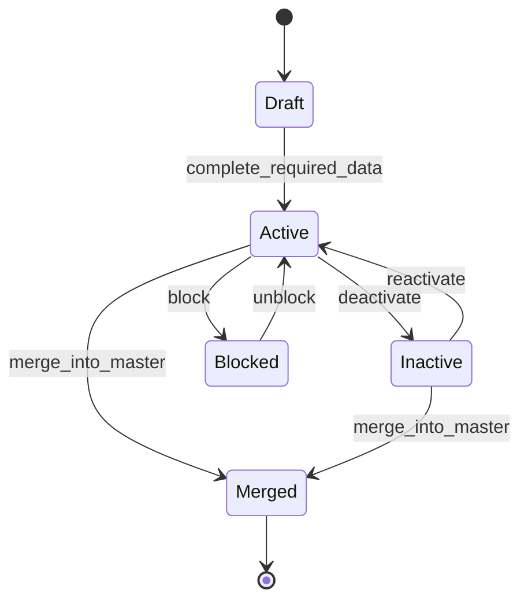

# CAP-001 Patient Management - State Machines

## Patient lifecycle

## State definitions

| State | Description |
|---|---|
| Draft | Patient captured partially, not yet usable for clinical orders. |
| Active | Patient can be used in operational flows. |
| Inactive | Patient is retained but cannot be used for new orders without reactivation. |
| Blocked | Patient requires supervisor authorization for operational use. |
| Merged | Patient is superseded by another master record. Future state, not MVP 1. |

## Transition rules

| Transition | Required permission | Event emitted |
|---|---|---|
| Draft → Active | `patients:create` | `PatientRegistered` |
| Active → Inactive | `patients:deactivate` | `PatientDeactivated` |
| Inactive → Active | `patients:reactivate` | `PatientReactivated` |
| Active → Blocked | `patients:block` | `PatientBlocked` |
| Blocked → Active | `patients:unblock` | `PatientUnblocked` |
