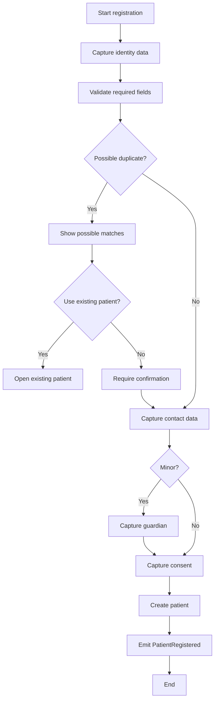
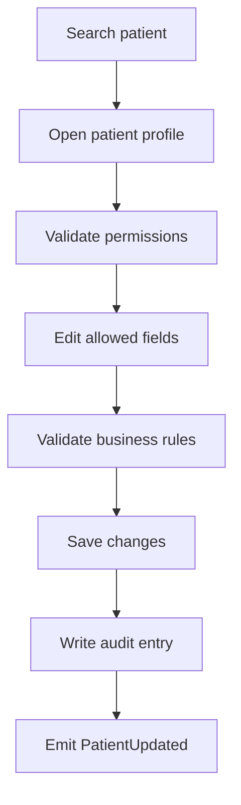
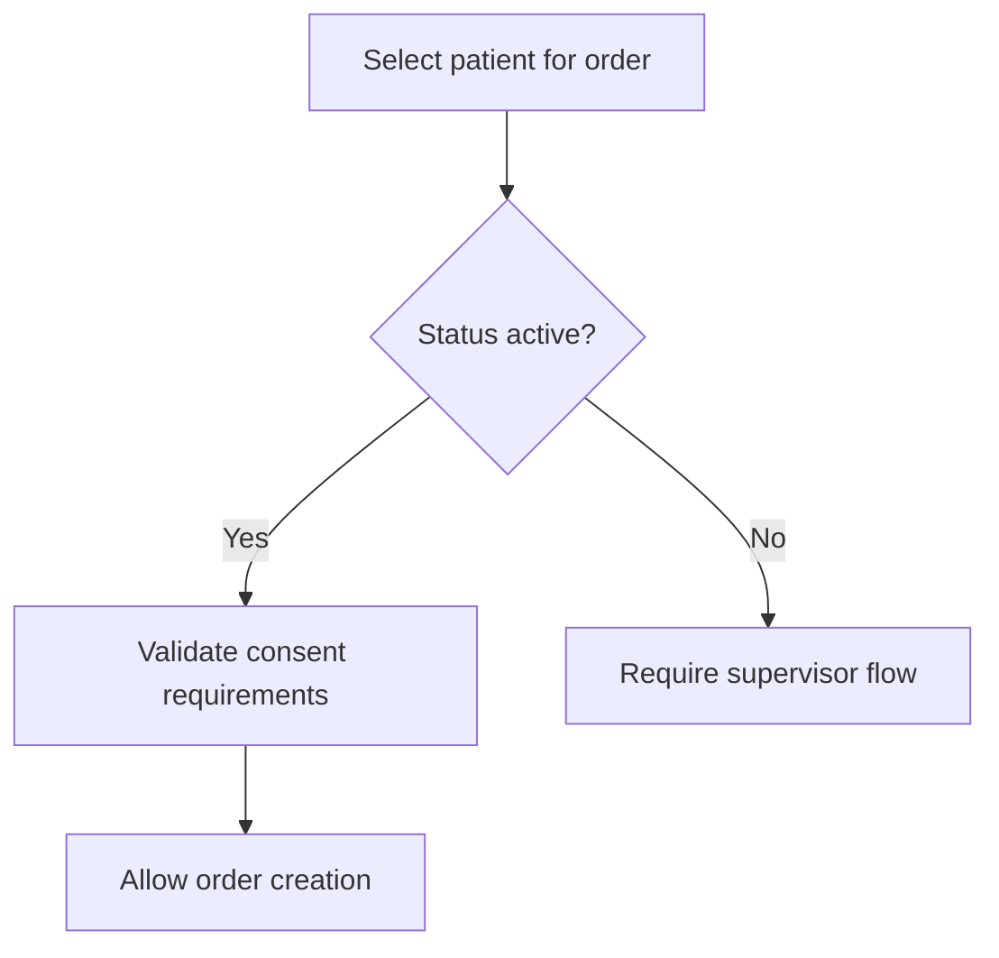

# CAP-001 Patient Management - Processes / BPMN

## Process CAP-001-PROC-001 Register Patient

```mermaid
flowchart TD
    A[Start registration] --> B[Capture identity data]
    B --> C[Validate required fields]
    C --> D{Possible duplicate?}
    D -- Yes --> E[Show possible matches]
    E --> F{Use existing patient?}
    F -- Yes --> G[Open existing patient]
    F -- No --> H[Require confirmation]
    D -- No --> I[Capture contact data]
    H --> I
    I --> J{Minor?}
    J -- Yes --> K[Capture guardian]
    J -- No --> L[Capture consent]
    K --> L
    L --> M[Create patient]
    M --> N[Emit PatientRegistered]
    N --> O[End]
```

## Process CAP-001-PROC-002 Update Patient

```mermaid
flowchart TD
    A[Search patient] --> B[Open patient profile]
    B --> C[Validate permissions]
    C --> D[Edit allowed fields]
    D --> E[Validate business rules]
    E --> F[Save changes]
    F --> G[Write audit entry]
    G --> H[Emit PatientUpdated]
```

## Process CAP-001-PROC-003 Prepare Patient for Order

```mermaid
flowchart TD
    A[Select patient for order] --> B{Status active?}
    B -- Yes --> C[Validate consent requirements]
    B -- No --> D[Require supervisor flow]
    C --> E[Allow order creation]
```
