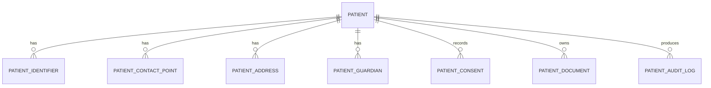

# CAP-001 Patient Management - Entities

## MVP entities

| Entity ID | Entity | Data type | Classification |
|---|---|---|---|
| ENT-001 | Patient | Master Data | Sensitive personal + clinical |
| ENT-002 | PatientIdentifier | Master Data | Sensitive personal |
| ENT-003 | PatientContactPoint | Master Data | Personal |
| ENT-004 | PatientAddress | Master Data | Personal |
| ENT-005 | PatientGuardian | Master Data | Personal |
| ENT-006 | PatientConsent | Compliance Data | Sensitive |
| ENT-007 | PatientClinicalProfile | Clinical Data | Sensitive clinical |
| ENT-008 | PatientDocument | Document Metadata | Sensitive |
| ENT-009 | PatientCommunicationPreference | Preference Data | Personal |
| ENT-010 | PatientAuditLog | Audit Data | Restricted |

## Conceptual ER

## Required cross-cutting columns

- `id`
- `tenant_id`
- `created_at`
- `created_by`
- `updated_at`
- `updated_by`
- `deleted_at`
- `deleted_by`
- `version`
- `status`
