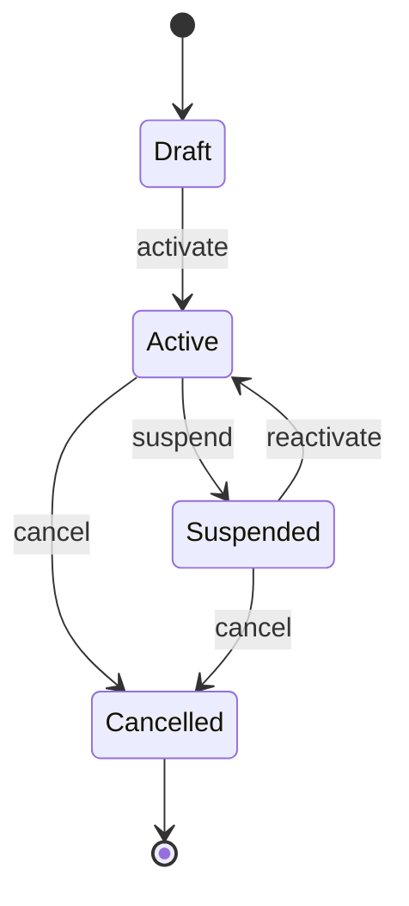
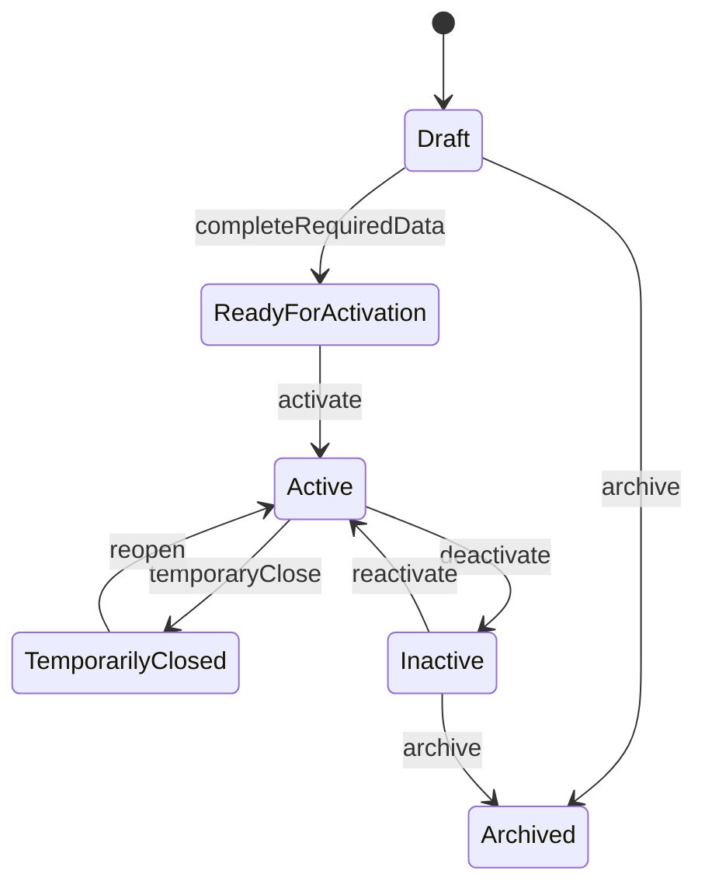
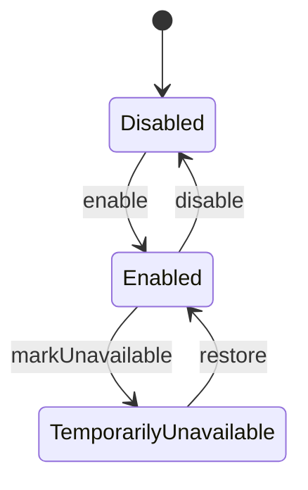

# 04 State Machines

## SM-ORG-001 Tenant Lifecycle

```mermaid
stateDiagram-v2
    [*] --> Draft
    Draft --> Active: activate
    Active --> Suspended: suspend
    Suspended --> Active: reactivate
    Active --> Cancelled: cancel
    Suspended --> Cancelled: cancel
    Cancelled --> [*]
```

## SM-ORG-002 Branch Lifecycle

```mermaid
stateDiagram-v2
    [*] --> Draft
    Draft --> ReadyForActivation: completeRequiredData
    ReadyForActivation --> Active: activate
    Active --> TemporarilyClosed: temporaryClose
    TemporarilyClosed --> Active: reopen
    Active --> Inactive: deactivate
    Draft --> Archived: archive
    Inactive --> Active: reactivate
    Inactive --> Archived: archive
```

## SM-ORG-003 Service Availability Lifecycle

```mermaid
stateDiagram-v2
    [*] --> Disabled
    Disabled --> Enabled: enable
    Enabled --> TemporarilyUnavailable: markUnavailable
    TemporarilyUnavailable --> Enabled: restore
    Enabled --> Disabled: disable
```
