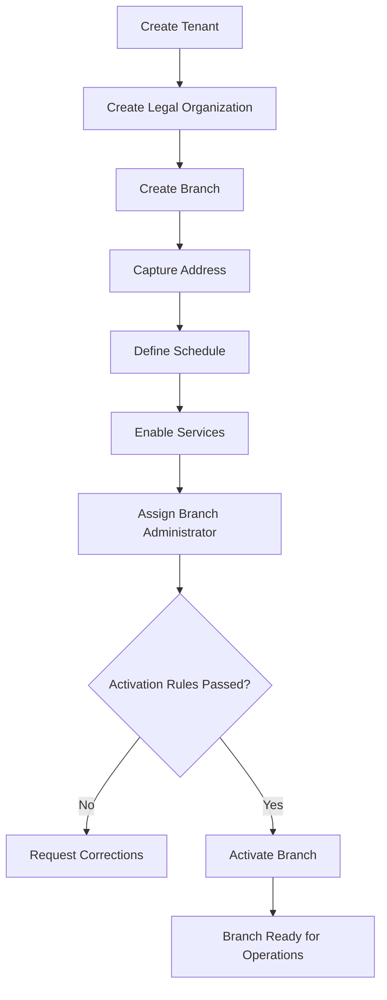
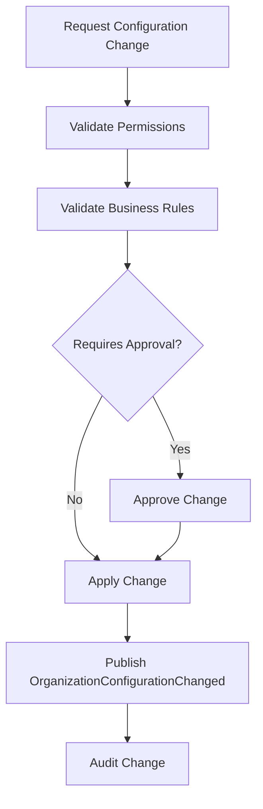

# 05 Processes BPMN

## Branch Onboarding Process

```mermaid
flowchart TD
    A[Create Tenant] --> B[Create Legal Organization]
    B --> C[Create Branch]
    C --> D[Capture Address]
    D --> E[Define Schedule]
    E --> F[Enable Services]
    F --> G[Assign Branch Administrator]
    G --> H{Activation Rules Passed?}
    H -- No --> I[Request Corrections]
    H -- Yes --> J[Activate Branch]
    J --> K[Branch Ready for Operations]
```

## Branch Configuration Change Process

```mermaid
flowchart TD
    A[Request Configuration Change] --> B[Validate Permissions]
    B --> C[Validate Business Rules]
    C --> D{Requires Approval?}
    D -- Yes --> E[Approve Change]
    D -- No --> F[Apply Change]
    E --> F
    F --> G[Publish OrganizationConfigurationChanged]
    G --> H[Audit Change]
```
