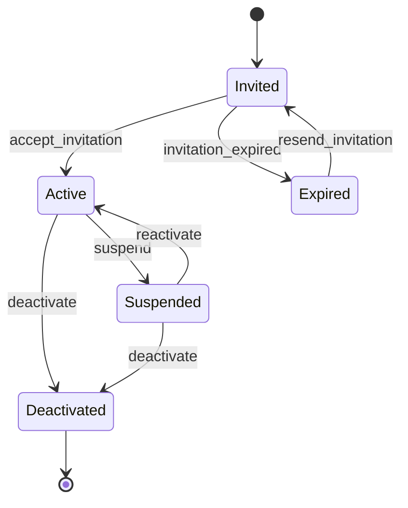
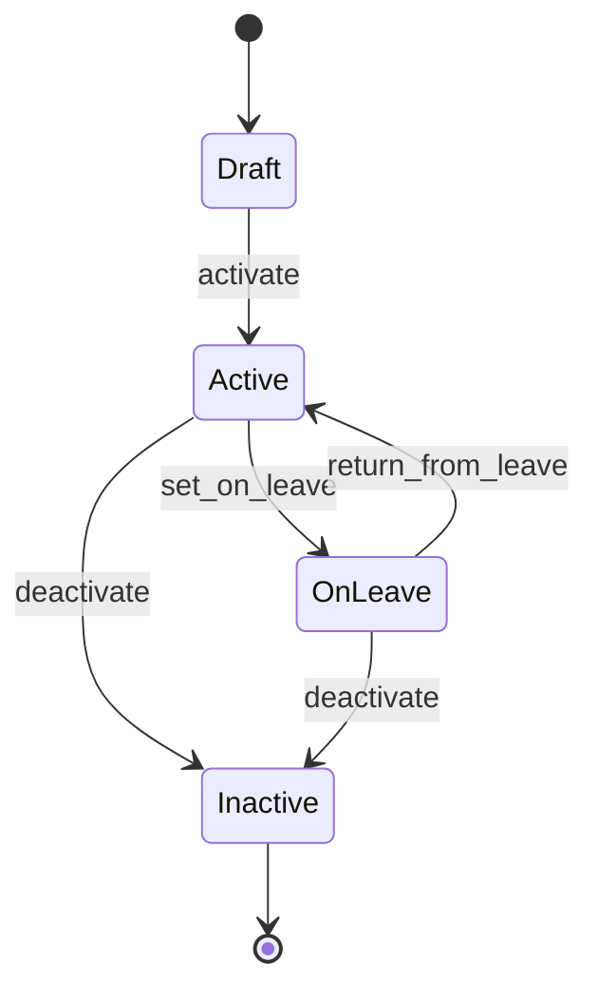
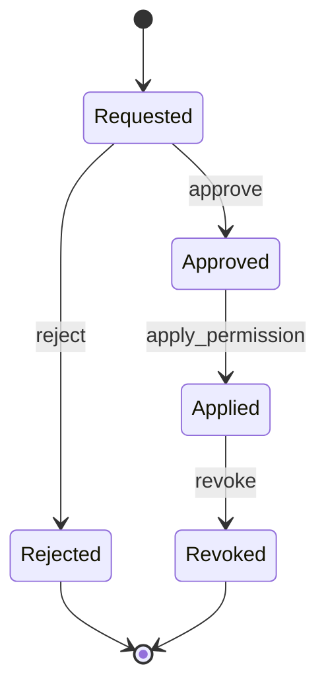

# 04 State Machines

## SM-IAM-001 User Account Lifecycle

```mermaid
stateDiagram-v2
    [*] --> Invited
    Invited --> Active: accept_invitation
    Invited --> Expired: invitation_expired
    Active --> Suspended: suspend
    Suspended --> Active: reactivate
    Active --> Deactivated: deactivate
    Suspended --> Deactivated: deactivate
    Expired --> Invited: resend_invitation
    Deactivated --> [*]
```

## SM-IAM-002 Employee Lifecycle

```mermaid
stateDiagram-v2
    [*] --> Draft
    Draft --> Active: activate
    Active --> OnLeave: set_on_leave
    OnLeave --> Active: return_from_leave
    Active --> Inactive: deactivate
    OnLeave --> Inactive: deactivate
    Inactive --> [*]
```

## SM-IAM-003 Access Request Lifecycle

```mermaid
stateDiagram-v2
    [*] --> Requested
    Requested --> Approved: approve
    Requested --> Rejected: reject
    Approved --> Applied: apply_permission
    Applied --> Revoked: revoke
    Rejected --> [*]
    Revoked --> [*]
```
