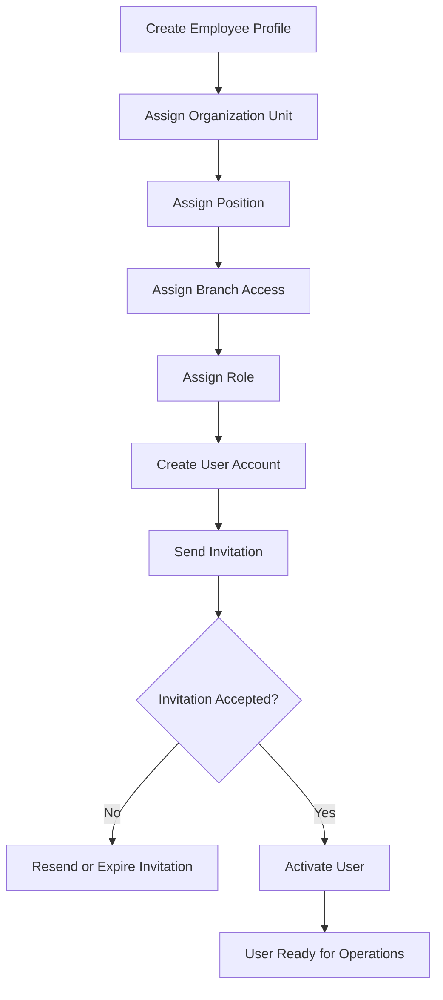
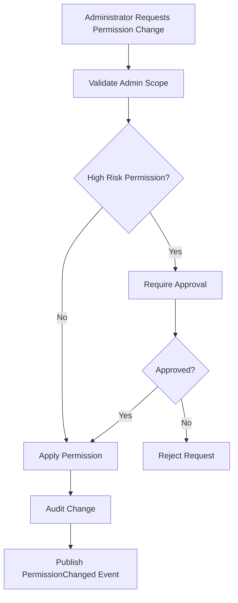
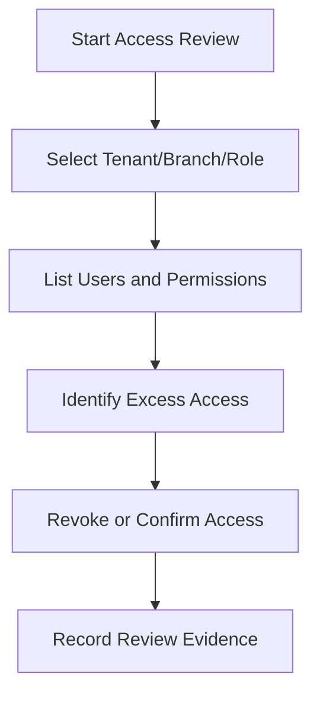

# 05 Processes BPMN

## Employee Onboarding Process

```mermaid
flowchart TD
    A[Create Employee Profile] --> B[Assign Organization Unit]
    B --> C[Assign Position]
    C --> D[Assign Branch Access]
    D --> E[Assign Role]
    E --> F[Create User Account]
    F --> G[Send Invitation]
    G --> H{Invitation Accepted?}
    H -- No --> I[Resend or Expire Invitation]
    H -- Yes --> J[Activate User]
    J --> K[User Ready for Operations]
```

## Permission Change Process

```mermaid
flowchart TD
    A[Administrator Requests Permission Change] --> B[Validate Admin Scope]
    B --> C{High Risk Permission?}
    C -- No --> D[Apply Permission]
    C -- Yes --> E[Require Approval]
    E --> F{Approved?}
    F -- No --> G[Reject Request]
    F -- Yes --> D
    D --> H[Audit Change]
    H --> I[Publish PermissionChanged Event]
```

## Access Review Process

```mermaid
flowchart TD
    A[Start Access Review] --> B[Select Tenant/Branch/Role]
    B --> C[List Users and Permissions]
    C --> D[Identify Excess Access]
    D --> E[Revoke or Confirm Access]
    E --> F[Record Review Evidence]
```
