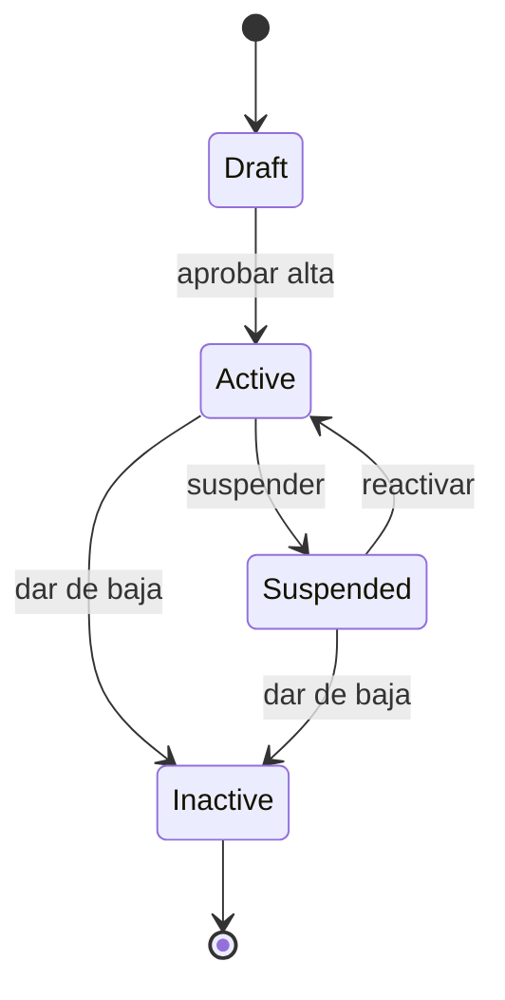
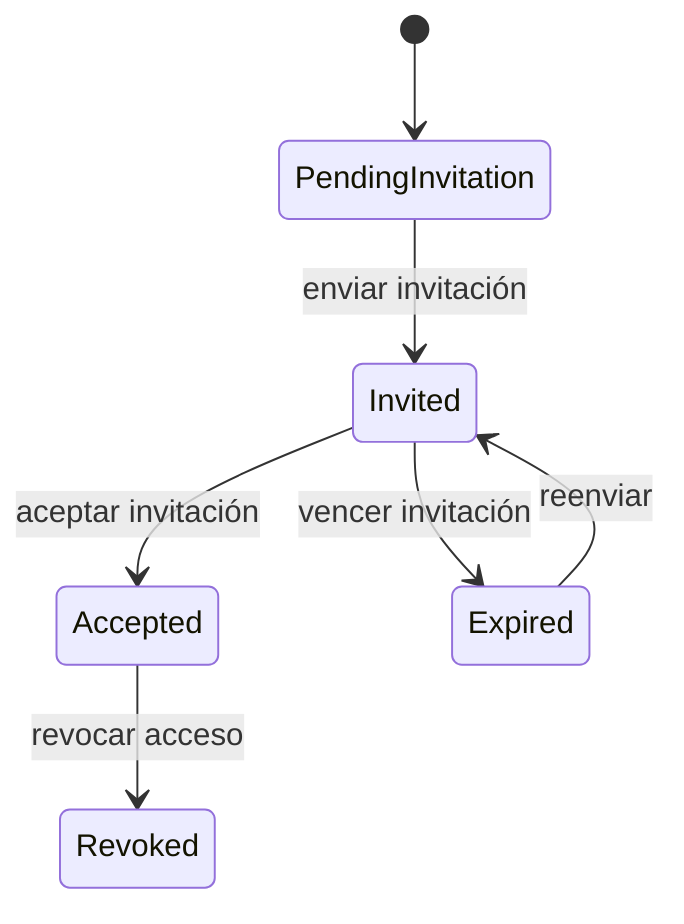

# 04 State Machines

## SM-MED-001 Estado del médico

```mermaid
stateDiagram-v2
  [*] --> Draft
  Draft --> Active: aprobar alta
  Active --> Suspended: suspender
  Suspended --> Active: reactivar
  Active --> Inactive: dar de baja
  Suspended --> Inactive: dar de baja
  Inactive --> [*]
```

## SM-MED-002 Estado de invitación al portal médico

```mermaid
stateDiagram-v2
  [*] --> PendingInvitation
  PendingInvitation --> Invited: enviar invitación
  Invited --> Accepted: aceptar invitación
  Invited --> Expired: vencer invitación
  Expired --> Invited: reenviar
  Accepted --> Revoked: revocar acceso
```
