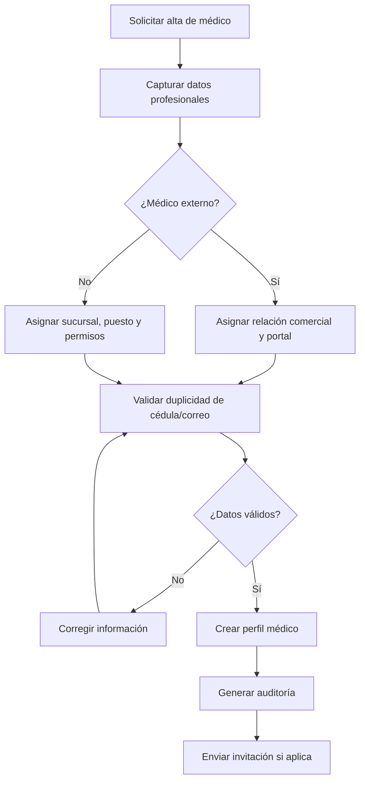
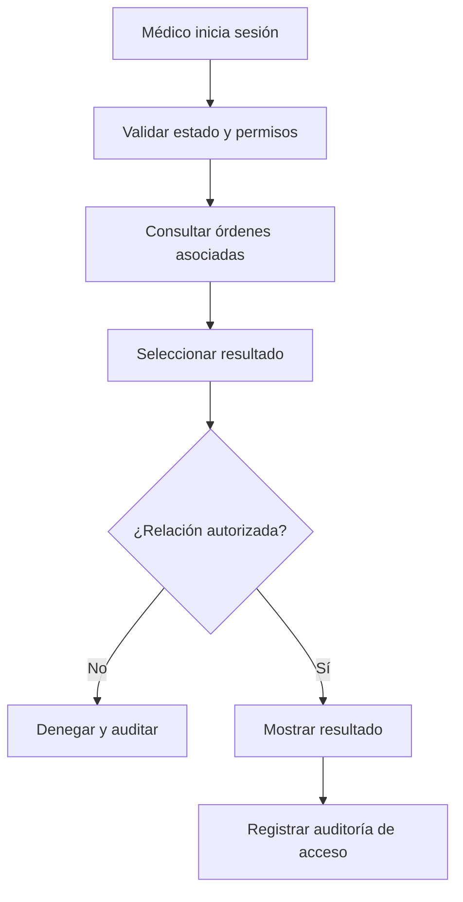

# 05 Processes BPMN

## BP-MED-001 Alta de médico

```mermaid
flowchart TD
  A[Solicitar alta de médico] --> B[Capturar datos profesionales]
  B --> C{¿Médico externo?}
  C -- Sí --> D[Asignar relación comercial y portal]
  C -- No --> E[Asignar sucursal, puesto y permisos]
  D --> F[Validar duplicidad de cédula/correo]
  E --> F
  F --> G{¿Datos válidos?}
  G -- No --> H[Corregir información]
  H --> F
  G -- Sí --> I[Crear perfil médico]
  I --> J[Generar auditoría]
  J --> K[Enviar invitación si aplica]
```

## BP-MED-002 Consulta de resultados por médico

```mermaid
flowchart TD
  A[Médico inicia sesión] --> B[Validar estado y permisos]
  B --> C[Consultar órdenes asociadas]
  C --> D[Seleccionar resultado]
  D --> E{¿Relación autorizada?}
  E -- No --> F[Denegar y auditar]
  E -- Sí --> G[Mostrar resultado]
  G --> H[Registrar auditoría de acceso]
```
