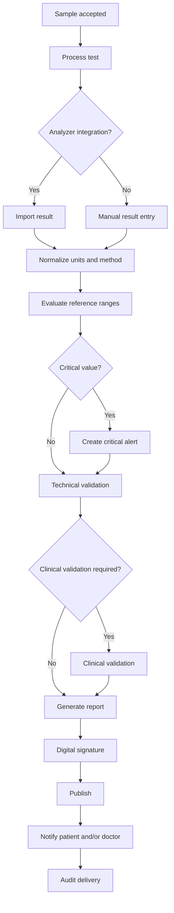

# Processes BPMN

## Laboratory Result Lifecycle

```mermaid
flowchart TD
  A[Sample accepted] --> B[Process test]
  B --> C{Analyzer integration?}
  C -->|Yes| D[Import result]
  C -->|No| E[Manual result entry]
  D --> F[Normalize units and method]
  E --> F
  F --> G[Evaluate reference ranges]
  G --> H{Critical value?}
  H -->|Yes| I[Create critical alert]
  H -->|No| J[Technical validation]
  I --> J
  J --> K{Clinical validation required?}
  K -->|Yes| L[Clinical validation]
  K -->|No| M[Generate report]
  L --> M
  M --> N[Digital signature]
  N --> O[Publish]
  O --> P[Notify patient and/or doctor]
  P --> Q[Audit delivery]
```
