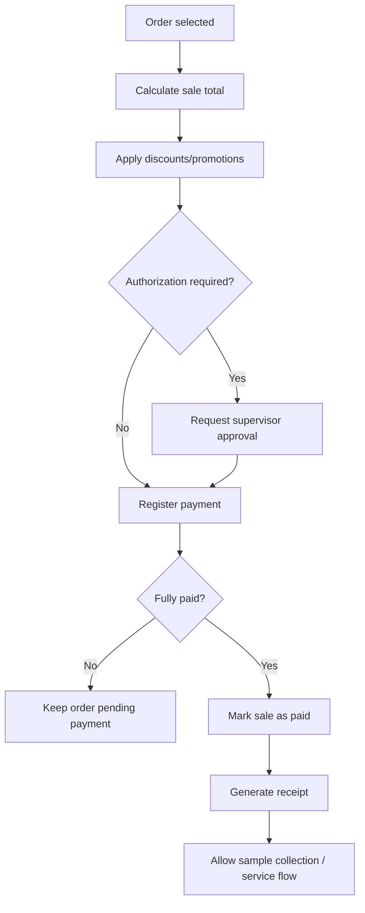
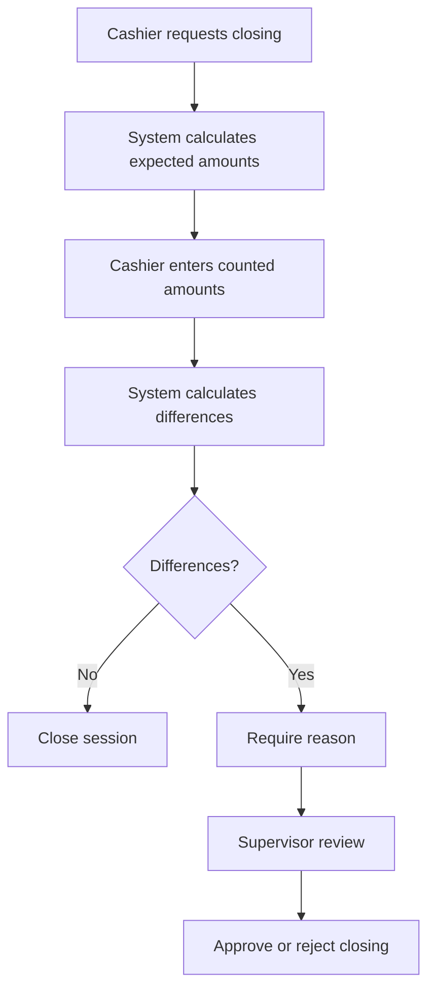

# BPMN Textual Process

## Sale and Payment Process

```mermaid
flowchart TD
  A[Order selected] --> B[Calculate sale total]
  B --> C[Apply discounts/promotions]
  C --> D{Authorization required?}
  D -- Yes --> E[Request supervisor approval]
  D -- No --> F[Register payment]
  E --> F
  F --> G{Fully paid?}
  G -- No --> H[Keep order pending payment]
  G -- Yes --> I[Mark sale as paid]
  I --> J[Generate receipt]
  J --> K[Allow sample collection / service flow]
```

## Cash Closing Process

```mermaid
flowchart TD
  A[Cashier requests closing] --> B[System calculates expected amounts]
  B --> C[Cashier enters counted amounts]
  C --> D[System calculates differences]
  D --> E{Differences?}
  E -- No --> F[Close session]
  E -- Yes --> G[Require reason]
  G --> H[Supervisor review]
  H --> I[Approve or reject closing]
```
