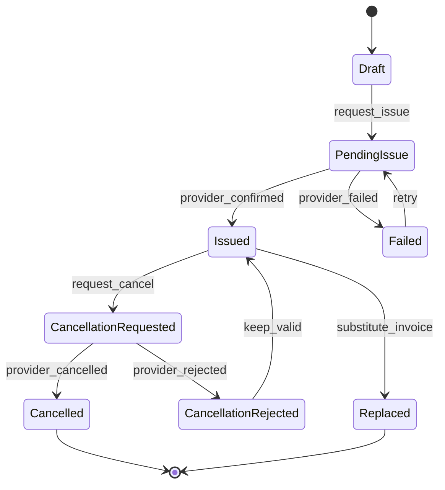
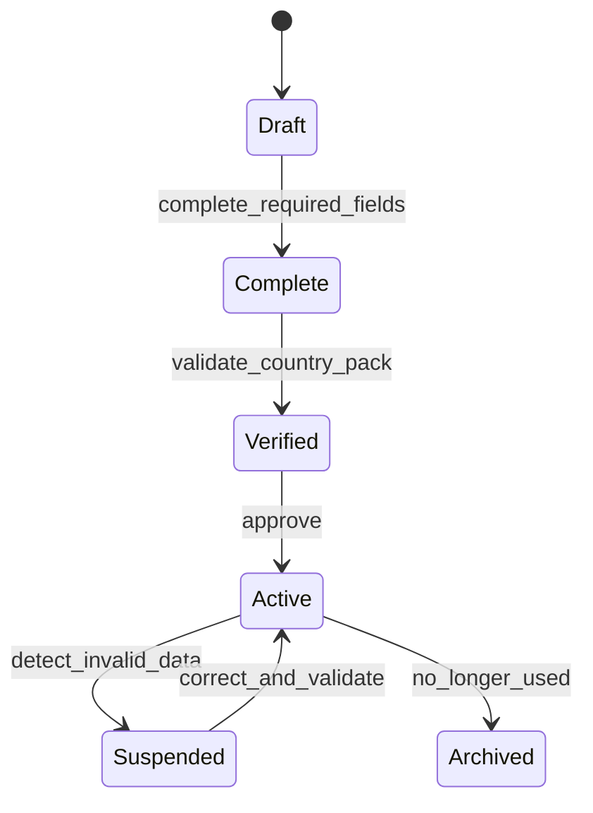
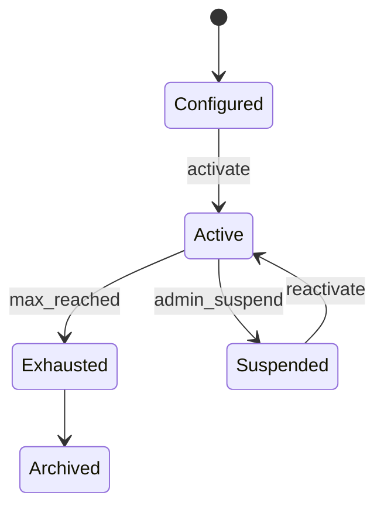

# 04 State Machines

## Invoice State Machine

```mermaid
stateDiagram-v2
    [*] --> Draft
    Draft --> PendingIssue: request_issue
    PendingIssue --> Issued: provider_confirmed
    PendingIssue --> Failed: provider_failed
    Failed --> PendingIssue: retry
    Issued --> CancellationRequested: request_cancel
    CancellationRequested --> Cancelled: provider_cancelled
    CancellationRequested --> CancellationRejected: provider_rejected
    CancellationRejected --> Issued: keep_valid
    Issued --> Replaced: substitute_invoice
    Cancelled --> [*]
    Replaced --> [*]
```

## Fiscal Profile State Machine

```mermaid
stateDiagram-v2
    [*] --> Draft
    Draft --> Complete: complete_required_fields
    Complete --> Verified: validate_country_pack
    Verified --> Active: approve
    Active --> Suspended: detect_invalid_data
    Suspended --> Active: correct_and_validate
    Active --> Archived: no_longer_used
```

## Folio Sequence State Machine

```mermaid
stateDiagram-v2
    [*] --> Configured
    Configured --> Active: activate
    Active --> Exhausted: max_reached
    Active --> Suspended: admin_suspend
    Suspended --> Active: reactivate
    Exhausted --> Archived
```
