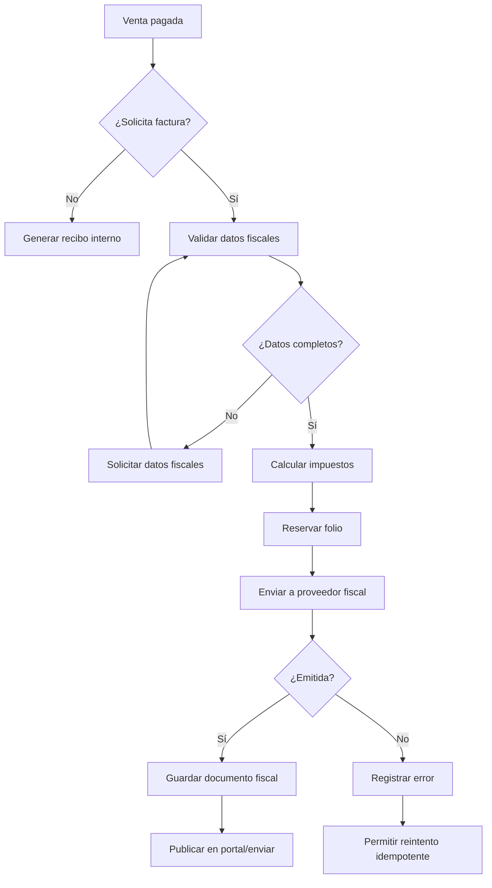
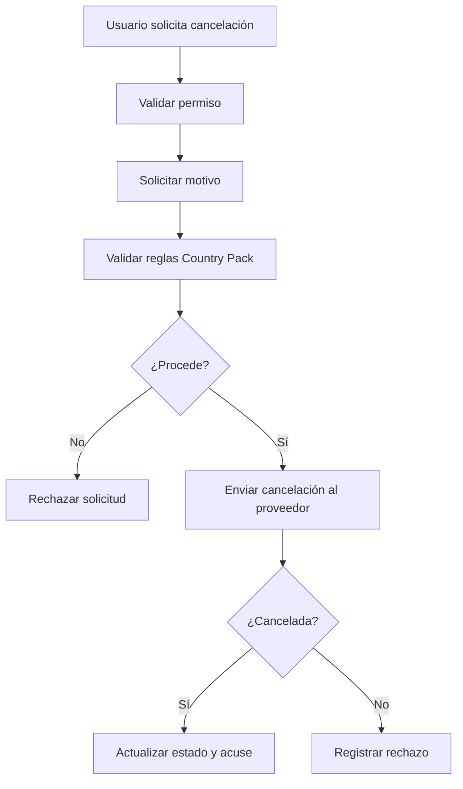

# 05 Processes BPMN

## Invoice issuing process

```mermaid
flowchart TD
    A[Venta pagada] --> B{¿Solicita factura?}
    B -- No --> C[Generar recibo interno]
    B -- Sí --> D[Validar datos fiscales]
    D --> E{¿Datos completos?}
    E -- No --> F[Solicitar datos fiscales]
    F --> D
    E -- Sí --> G[Calcular impuestos]
    G --> H[Reservar folio]
    H --> I[Enviar a proveedor fiscal]
    I --> J{¿Emitida?}
    J -- Sí --> K[Guardar documento fiscal]
    K --> L[Publicar en portal/enviar]
    J -- No --> M[Registrar error]
    M --> N[Permitir reintento idempotente]
```

## Invoice cancellation process

```mermaid
flowchart TD
    A[Usuario solicita cancelación] --> B[Validar permiso]
    B --> C[Solicitar motivo]
    C --> D[Validar reglas Country Pack]
    D --> E{¿Procede?}
    E -- No --> F[Rechazar solicitud]
    E -- Sí --> G[Enviar cancelación al proveedor]
    G --> H{¿Cancelada?}
    H -- Sí --> I[Actualizar estado y acuse]
    H -- No --> J[Registrar rechazo]
```
