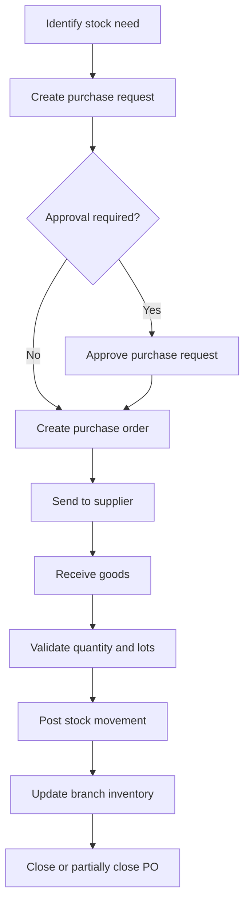
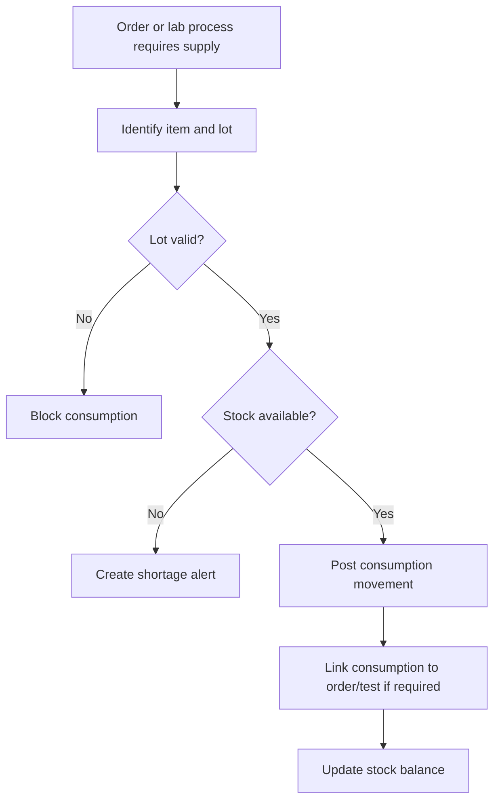

# Processes BPMN

## Purchase to Stock Process

```mermaid
flowchart TD
    A[Identify stock need] --> B[Create purchase request]
    B --> C{Approval required?}
    C -- No --> D[Create purchase order]
    C -- Yes --> E[Approve purchase request]
    E --> D
    D --> F[Send to supplier]
    F --> G[Receive goods]
    G --> H[Validate quantity and lots]
    H --> I[Post stock movement]
    I --> J[Update branch inventory]
    J --> K[Close or partially close PO]
```

## Consumption Process

```mermaid
flowchart TD
    A[Order or lab process requires supply] --> B[Identify item and lot]
    B --> C{Lot valid?}
    C -- No --> D[Block consumption]
    C -- Yes --> E{Stock available?}
    E -- No --> F[Create shortage alert]
    E -- Yes --> G[Post consumption movement]
    G --> H[Link consumption to order/test if required]
    H --> I[Update stock balance]
```
