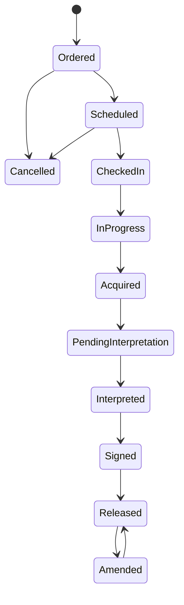
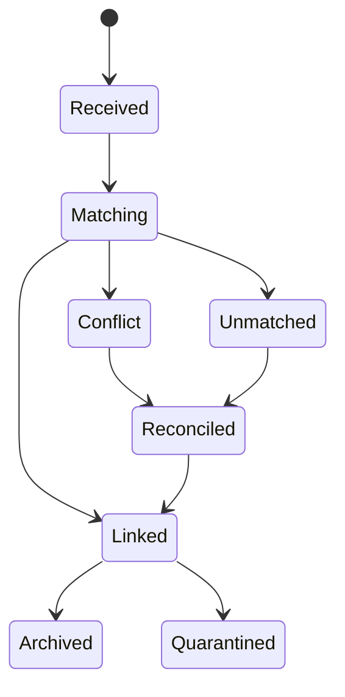
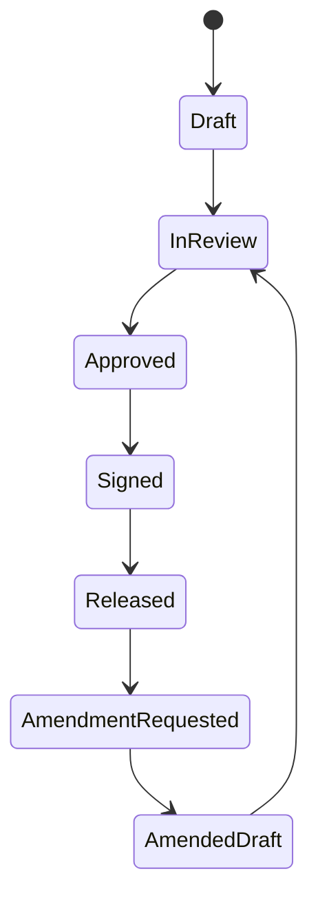
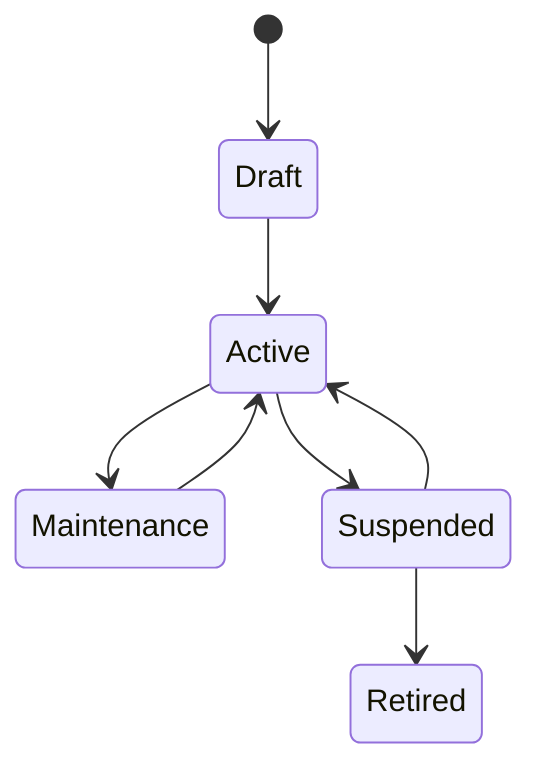

# State Machines

## Imaging Study State

```mermaid
stateDiagram-v2
    [*] --> Ordered
    Ordered --> Scheduled
    Ordered --> Cancelled
    Scheduled --> CheckedIn
    Scheduled --> Cancelled
    CheckedIn --> InProgress
    InProgress --> Acquired
    Acquired --> PendingInterpretation
    PendingInterpretation --> Interpreted
    Interpreted --> Signed
    Signed --> Released
    Released --> Amended
    Amended --> Released
```

## DICOM Study State

```mermaid
stateDiagram-v2
    [*] --> Received
    Received --> Matching
    Matching --> Linked
    Matching --> Unmatched
    Matching --> Conflict
    Conflict --> Reconciled
    Unmatched --> Reconciled
    Reconciled --> Linked
    Linked --> Archived
    Linked --> Quarantined
```

## Imaging Report State

```mermaid
stateDiagram-v2
    [*] --> Draft
    Draft --> InReview
    InReview --> Approved
    Approved --> Signed
    Signed --> Released
    Released --> AmendmentRequested
    AmendmentRequested --> AmendedDraft
    AmendedDraft --> InReview
```

## Modality State

```mermaid
stateDiagram-v2
    [*] --> Draft
    Draft --> Active
    Active --> Maintenance
    Maintenance --> Active
    Active --> Suspended
    Suspended --> Active
    Suspended --> Retired
```
