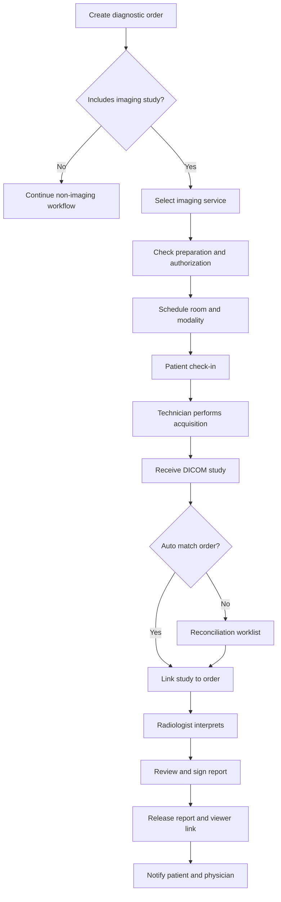
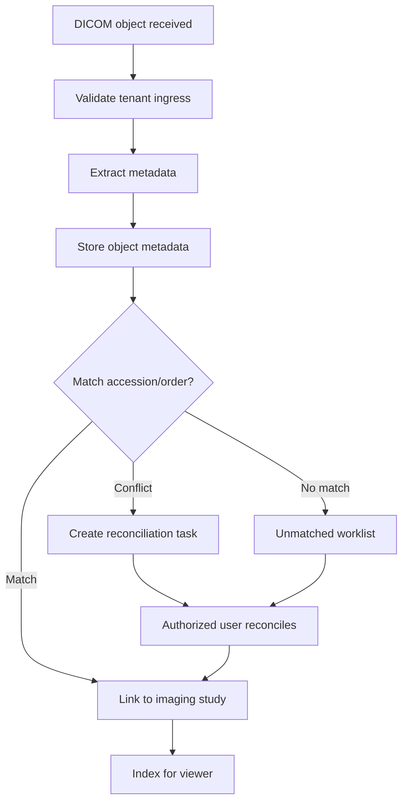
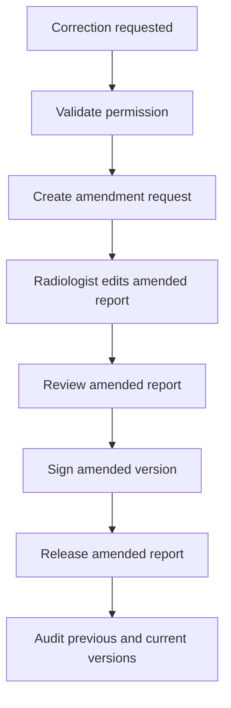

# Processes BPMN

## Imaging Appointment to Report Process

```mermaid
flowchart TD
    A[Create diagnostic order] --> B{Includes imaging study?}
    B -- No --> Z[Continue non-imaging workflow]
    B -- Yes --> C[Select imaging service]
    C --> D[Check preparation and authorization]
    D --> E[Schedule room and modality]
    E --> F[Patient check-in]
    F --> G[Technician performs acquisition]
    G --> H[Receive DICOM study]
    H --> I{Auto match order?}
    I -- Yes --> J[Link study to order]
    I -- No --> K[Reconciliation worklist]
    K --> J
    J --> L[Radiologist interprets]
    L --> M[Review and sign report]
    M --> N[Release report and viewer link]
    N --> O[Notify patient and physician]
```

## DICOM Ingestion and Reconciliation Process

```mermaid
flowchart TD
    A[DICOM object received] --> B[Validate tenant ingress]
    B --> C[Extract metadata]
    C --> D[Store object metadata]
    D --> E{Match accession/order?}
    E -- Match --> F[Link to imaging study]
    E -- Conflict --> G[Create reconciliation task]
    E -- No match --> H[Unmatched worklist]
    G --> I[Authorized user reconciles]
    H --> I
    I --> F
    F --> J[Index for viewer]
```

## Report Amendment Process

```mermaid
flowchart TD
    A[Correction requested] --> B[Validate permission]
    B --> C[Create amendment request]
    C --> D[Radiologist edits amended report]
    D --> E[Review amended report]
    E --> F[Sign amended version]
    F --> G[Release amended report]
    G --> H[Audit previous and current versions]
```
