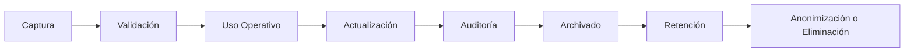

# Information Lifecycle

## Ciclo de vida estándar

## Etapas

### 1. Captura
El dato entra mediante web, móvil, API, importación, equipo de laboratorio, DICOM, OCR o carga manual.

### 2. Validación
Se aplican reglas de negocio, validaciones de formato, duplicidad, permisos y consistencia.

### 3. Uso operativo
El dato participa en procesos: recepción, caja, toma de muestra, resultados, facturación, inventario o reportes.

### 4. Actualización
Todo cambio sensible debe guardar actor, fecha, razón y valores anteriores cuando aplique.

### 5. Auditoría
Los eventos clínicos, financieros y de seguridad deben generar evidencia trazable.

### 6. Archivado
Cuando el dato deja de estar activo, pasa a almacenamiento histórico con acceso controlado.

### 7. Retención
La retención depende del país, tipo de dato, regulación, contrato y política del laboratorio.

### 8. Anonimización o eliminación
Cuando legalmente sea posible, el dato puede anonimizarse o eliminarse de forma controlada.

## Reglas

- La eliminación física no debe ser la opción por defecto para datos clínicos o financieros.
- El soft delete debe utilizarse para objetos operativos salvo que una política indique lo contrario.
- Las políticas de retención deben ser configurables mediante Country Packs.
