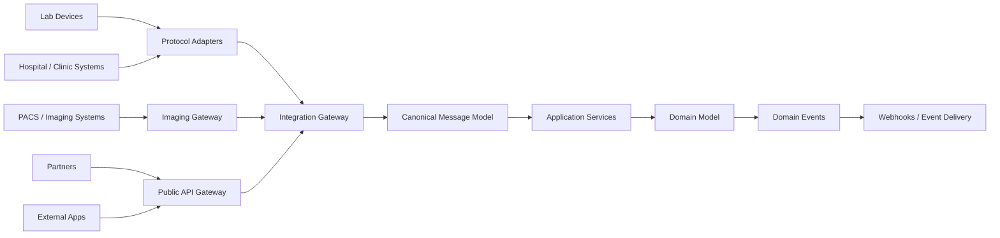

# Integration Context View

**Artifact ID:** IIA-VIEW-001  
**Version:** 0.20.0  

```mermaid
flowchart LR
  DEV[Lab Devices] --> ADP[Protocol Adapters]
  HIS[Hospital / Clinic Systems] --> ADP
  PACS[PACS / Imaging Systems] --> IMG[Imaging Gateway]
  PARTNERS[Partners] --> API[Public API Gateway]
  APPS[External Apps] --> API
  ADP --> IGW[Integration Gateway]
  IMG --> IGW
  API --> IGW
  IGW --> CAN[Canonical Message Model]
  CAN --> APP[Application Services]
  APP --> DOM[Domain Model]
  DOM --> EVT[Domain Events]
  EVT --> WH[Webhooks / Event Delivery]
```
