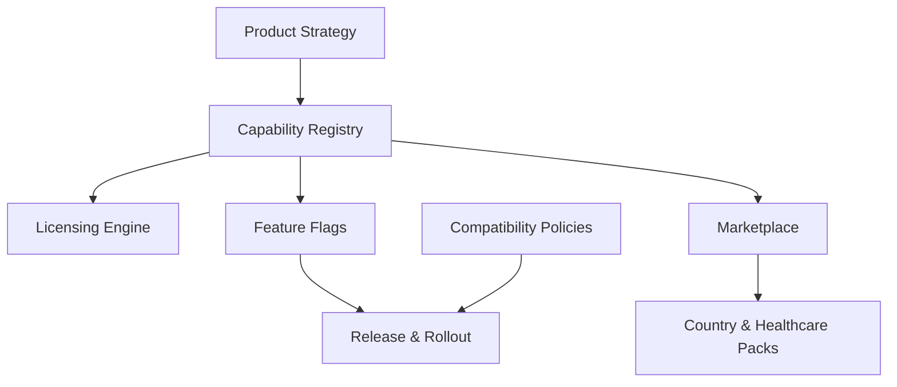

# Product Evolution Architecture Baseline

**Artifact ID:** PEA-001  
**Status:** Draft  
**Version:** 0.22.0  
**Owner:** Product Architecture

## Purpose

Nexora must support long-term evolution across countries, healthcare verticals, deployment profiles, AI providers, infrastructure providers, and commercial models.

The product must avoid becoming a fixed implementation tied to a single market, a single technology stack, a single cloud, or a single agent.

## Core Principles

### Evolution First

Every capability, API, integration, UI surface, workflow, AI feature and deployment mode must be designed to evolve without forcing a full rewrite.

### Backward Compatibility

Existing customers must not be broken by new versions. APIs, mobile clients, integrations and data migrations must follow controlled compatibility policies.

### Capability-Based Product Design

Nexora products are composed from reusable business and technical capabilities.

### Feature-Flagged Delivery

New capabilities must be released progressively by tenant, branch, country, license, role, user segment or environment.

### Marketplace Ready

Country-specific, integration-specific and healthcare-specific extensions must be delivered as replaceable product packages.

### Commercial Configuration Over Code

Plans, limits, modules, usage quotas and entitlements must be configured, not hard-coded.

## Product Evolution Layers

## Scope for MVP 1

MVP 1 must include only the minimum runtime foundations required to support future evolution:

- Tenant-level plan assignment.
- Feature flag evaluation model.
- License entitlement model.
- Country pack abstraction.
- Compatibility policy for APIs.
- Deprecation metadata in OpenAPI.
- Product lifecycle states.

Implementation may be simple, but the model must exist from the beginning.
