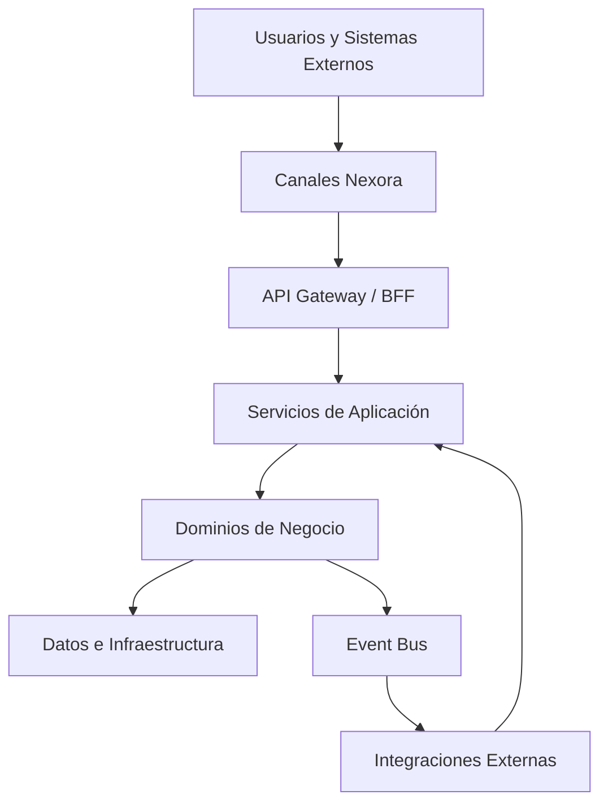

# Application Architecture Baseline

**ID:** APP-ARCH-001
**Estado:** Approved
**Versión:** 0.17.0
**Owner:** Enterprise Architecture

## Propósito

Definir la capa de aplicaciones de Nexora para conectar capacidades de negocio, dominios DDD, canales de usuario, APIs, integraciones y unidades desplegables.

Nexora no debe construirse como una colección de CRUDs aislados. Debe construirse como un ecosistema de aplicaciones que comparten capacidades, reglas y contratos.

## Vista conceptual



## Aplicaciones principales

| ID | Aplicación | Propósito |
|---|---|---|
| APP-001 | Nexora Public Website | Captación, información, SEO, cotizaciones públicas y acceso a portales. |
| APP-002 | Nexora Admin Portal | Operación interna para empleados, laboratorios, sucursales, caja, resultados e inventario. |
| APP-003 | Nexora Patient Portal | Consulta de resultados, citas, pagos, facturas y comunicación con el laboratorio. |
| APP-004 | Nexora Doctor Portal | Consulta de pacientes referidos, resultados, historial y solicitudes de estudios. |
| APP-005 | Nexora Mobile Patient App | Experiencia móvil para pacientes con bajo consumo y capacidades progresivas. |
| APP-006 | Nexora Mobile Doctor App | Acceso móvil para médicos, notificaciones y seguimiento. |
| APP-007 | Nexora Public API | API para integraciones externas, partners, marketplace y ecosistema. |
| APP-008 | Nexora Integration Gateway | Capa de interoperabilidad ASTM, HL7, FHIR, DICOM, SFTP, webhooks y REST. |
| APP-009 | Nexora AI Assistant Layer | Capacidades IA reutilizables para recepción, médicos, pacientes y operación. |
| APP-010 | Nexora Analytics Console | Dashboards, KPIs, BI y analítica ejecutiva. |

## Capas de aplicación

### 1. Experience Layer
Incluye web, mobile, portales y consola administrativa. No contiene reglas críticas de negocio.

### 2. API/BFF Layer
Expone contratos estables para cada experiencia. Puede adaptar respuestas para web/mobile sin duplicar reglas del dominio.

### 3. Application Service Layer
Orquesta casos de uso, validaciones de aplicación, transacciones, políticas de permisos y publicación de eventos.

### 4. Domain Layer
Contiene reglas de negocio, agregados, entidades, value objects y eventos de dominio.

### 5. Infrastructure Layer
Implementa persistencia, mensajería, almacenamiento, identidad, proveedores externos y observabilidad.

## Reglas de arquitectura

- Ningún canal accede directamente a la base de datos.
- Ningún canal implementa reglas clínicas, fiscales o de negocio críticas.
- Todo endpoint público debe tener contrato OpenAPI.
- Todo evento de dominio debe estar documentado y versionado.
- Toda aplicación debe soportar i18n desde el diseño.
- Las aplicaciones deben degradar capacidades avanzadas de forma progresiva en dispositivos modestos.
- Las funciones IA deben tener fallback funcional sin IA cuando aplique.

<!-- NEXORA_STRUCTURED_PAYLOAD_V1 -->

## Structured Payload

```yaml
id: APP-ARCH-001
name: Application Architecture Baseline
version: 0.17.0
status: Approved
owner: Enterprise Architecture
principles:
- Capability Driven Applications
- API Contract First
- Channel Independence
- Deployable Unit Agnostic
- Integration Ready
layers:
- id: app-layer-experience
  name: Experience Layer
  responsibility: Web, mobile, portals and administrative consoles.
- id: app-layer-api-bff
  name: API/BFF Layer
  responsibility: Stable APIs and experience-specific adaptation.
- id: app-layer-application-services
  name: Application Service Layer
  responsibility: Use case orchestration, authorization, transactions and events.
- id: app-layer-domain
  name: Domain Layer
  responsibility: Business rules, aggregates, entities, value objects and domain events.
- id: app-layer-infrastructure
  name: Infrastructure Layer
  responsibility: Persistence, messaging, identity, storage and providers.
applications:
- id: APP-001
  name: Nexora Public Website
  type: Web
  channels:
  - public
  capabilities:
  - Marketing
  - Quotation
  - AppointmentRequest
- id: APP-002
  name: Nexora Admin Portal
  type: Web
  channels:
  - employee
  capabilities:
  - PatientManagement
  - Orders
  - Results
  - Cashier
  - Billing
  - Inventory
  - IAM
- id: APP-003
  name: Nexora Patient Portal
  type: Web
  channels:
  - patient
  capabilities:
  - PatientSelfService
  - ResultsDelivery
  - Appointments
  - Payments
- id: APP-004
  name: Nexora Doctor Portal
  type: Web
  channels:
  - doctor
  capabilities:
  - DoctorManagement
  - ResultsConsultation
  - ReferralManagement
- id: APP-005
  name: Nexora Mobile Patient App
  type: Mobile
  channels:
  - patient
  capabilities:
  - PatientSelfService
  - ResultsDelivery
  - Notifications
- id: APP-006
  name: Nexora Mobile Doctor App
  type: Mobile
  channels:
  - doctor
  capabilities:
  - ResultsConsultation
  - CriticalAlerts
  - PatientFollowUp
- id: APP-007
  name: Nexora Public API
  type: API
  channels:
  - external
  - partner
  capabilities:
  - Integration
  - Marketplace
  - PublicContracts
- id: APP-008
  name: Nexora Integration Gateway
  type: Integration
  channels:
  - external-systems
  capabilities:
  - ASTM
  - HL7
  - FHIR
  - DICOM
  - Webhooks
  - SFTP
- id: APP-009
  name: Nexora AI Assistant Layer
  type: AI
  channels:
  - employee
  - patient
  - doctor
  capabilities:
  - OCR
  - LLM
  - RAG
  - Summarization
  - TriageSupport
- id: APP-010
  name: Nexora Analytics Console
  type: Analytics
  channels:
  - executive
  - administrator
  capabilities:
  - KPIs
  - BI
  - OperationalAnalytics
rules:
- No channel may access the database directly.
- No channel may implement critical business, clinical or fiscal rules.
- Public APIs must have OpenAPI contracts.
- Domain events must be documented and versioned.
- Applications must support i18n by design.
- AI capabilities must provide fallback behavior when unavailable.
```
