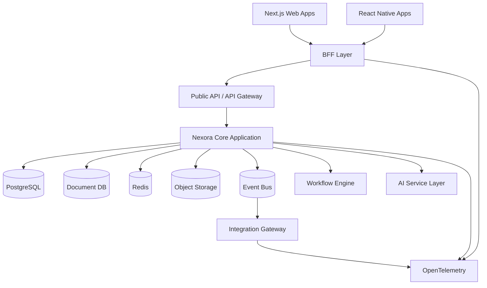

# Application Container View

**ID:** APP-C4-001
**Estado:** Draft
**Versión:** 0.17.0

## Nota

Esta vista describe contenedores lógicos. No obliga a una tecnología o proveedor específico. Cada contenedor puede mapearse a Docker Compose, Docker Swarm, Kubernetes, serverless functions o despliegue on-premise según el perfil de instalación.
