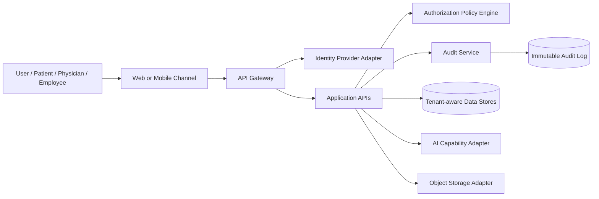

# Security Context View

## Notes

- All user actions pass through authentication and authorization.
- Backend use cases enforce permissions.
- Audit is required for sensitive operations.
- AI access is mediated by privacy and authorization controls.
