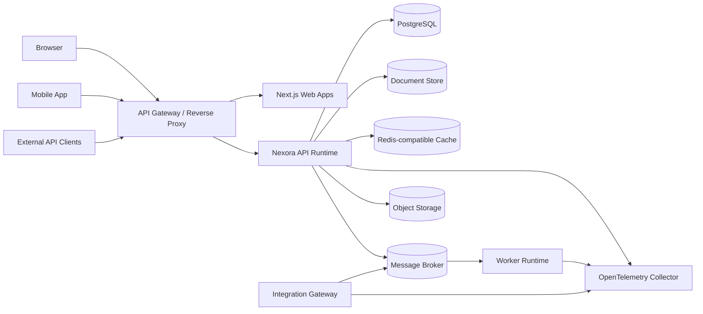

# Technology C4 Container View

```mermaid
flowchart LR
    Browser[Browser]
    Mobile[Mobile App]
    PublicAPI[External API Clients]

    Gateway[API Gateway / Reverse Proxy]
    Web[Next.js Web Apps]
    API[Nexora API Runtime]
    Worker[Worker Runtime]
    Integrations[Integration Gateway]

    Postgres[(PostgreSQL)]
    Mongo[(Document Store)]
    Redis[(Redis-compatible Cache)]
    Queue[(Message Broker)]
    Storage[(Object Storage)]
    Observability[OpenTelemetry Collector]

    Browser --> Gateway
    Mobile --> Gateway
    PublicAPI --> Gateway
    Gateway --> Web
    Gateway --> API
    API --> Postgres
    API --> Mongo
    API --> Redis
    API --> Queue
    API --> Storage
    Queue --> Worker
    Integrations --> Queue
    API --> Observability
    Worker --> Observability
    Integrations --> Observability
```
