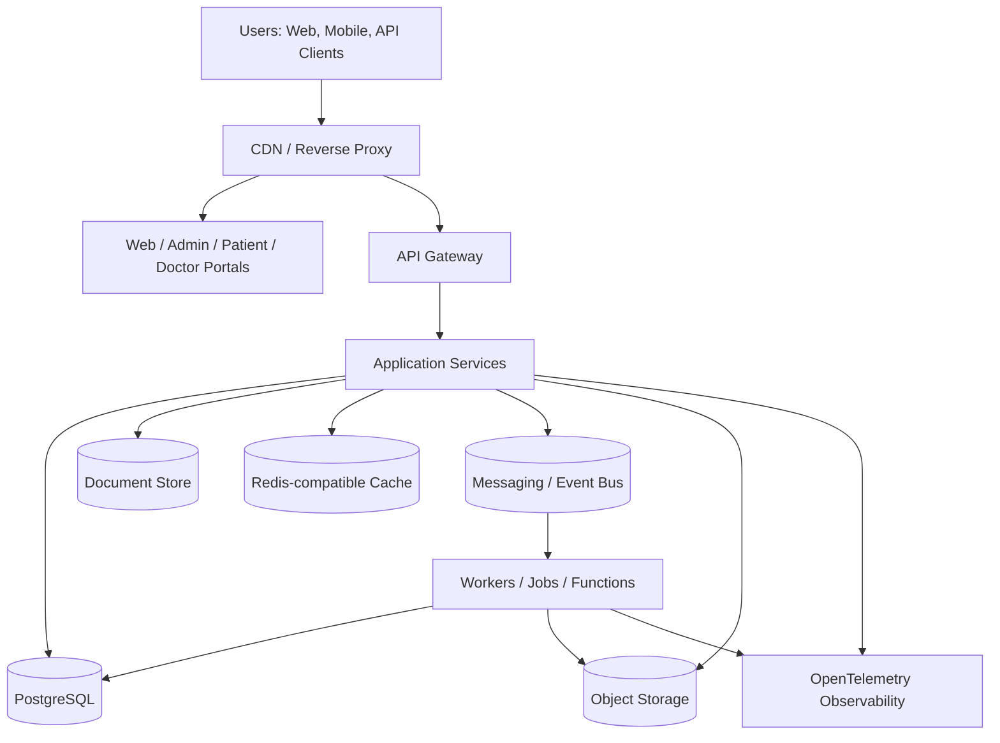

# Nexora Technology Architecture

## Objetivo

Definir una arquitectura tecnológica portable para Nexora que permita ejecutar la plataforma desde un entorno local de desarrollo hasta instalaciones empresariales en Kubernetes o nube pública, sin acoplar el dominio de negocio a proveedores específicos.

## Principios

### 1. Anywhere First

Nexora debe poder ejecutarse en cualquier entorno razonable: laptop, servidor local, VPS, on-premise, Docker Swarm, Kubernetes o nube pública.

### 2. Cloud Agnostic

Ningún componente crítico debe depender de AWS, Azure, GCP, DigitalOcean u otro proveedor. Cuando se use un servicio administrado, debe existir una abstracción o alternativa portable.

### 3. Platform Agnostic

La misma aplicación debe poder desplegarse mediante Docker Compose, Docker Swarm, Kubernetes, Helm o entornos equivalentes.

### 4. Compute Agnostic

Un dominio puede ejecutarse como parte de un monolito modular, como servicio independiente, como worker o como función serverless, siempre que conserve sus contratos, puertos y adaptadores.

### 5. Local Development First

Un desarrollador debe poder levantar el ambiente base con comandos simples, sin depender de credenciales cloud ni infraestructura externa.

## Vista tecnológica de alto nivel

## Componentes tecnológicos base

| Capa | Estándar Nexora | Alternativas soportables |
|---|---|---|
| Runtime | Contenedores OCI | Docker, containerd, Podman |
| Orquestación local | Docker Compose | Podman Compose |
| Orquestación team | Docker Swarm | Nomad, Rancher local |
| Orquestación enterprise | Kubernetes | OpenShift, Rancher, managed K8s |
| Base relacional | PostgreSQL | Compatible SQL futuro mediante repositorios |
| Documentos | MongoDB-compatible | Document DB portable o PostgreSQL JSONB cuando aplique |
| Cache | Redis-compatible | Valkey, Dragonfly |
| Colas/Eventos | RabbitMQ/NATS baseline | Kafka, SQS, Service Bus mediante adaptadores |
| Object Storage | S3-compatible abstraction | MinIO, S3, GCS, Azure Blob, Ceph |
| Observabilidad | OpenTelemetry | Jaeger, Prometheus, Grafana, Tempo, Loki |
| API Gateway | Standard gateway | Traefik, Kong, APISIX, Envoy, NGINX |
| Identidad | OIDC/OAuth2 | Keycloak, Authentik, Okta, Entra ID, Cognito |

## Restricciones

- El dominio no debe importar SDKs cloud directamente.
- Los adaptadores de infraestructura deben vivir fuera del dominio.
- La configuración debe inyectarse por variables de entorno, archivos de configuración o secretos, nunca estar codificada.
- Todo servicio debe exponer health checks y métricas básicas.
- Todo despliegue debe contar con logs estructurados y trazas distribuidas cuando aplique.
