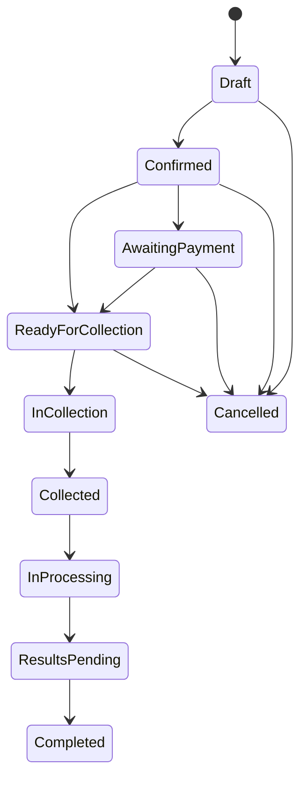
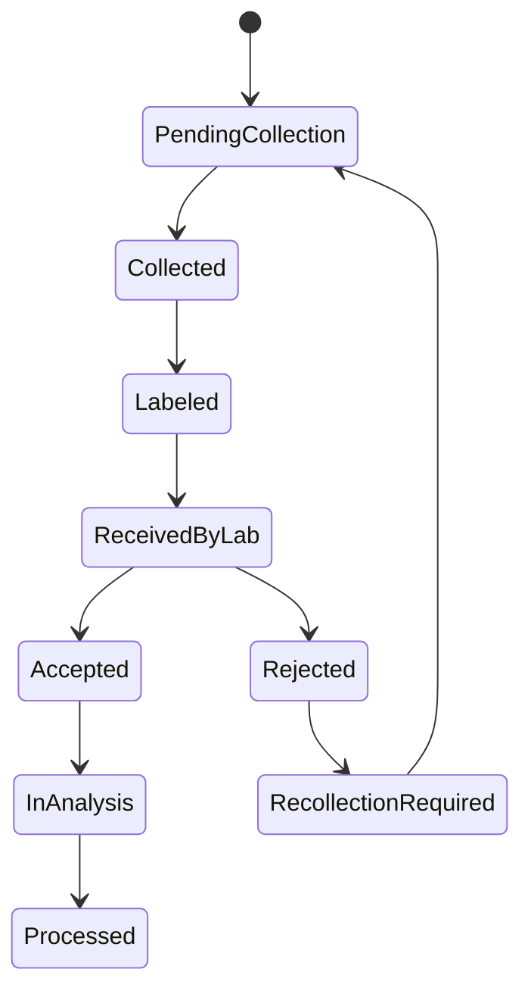
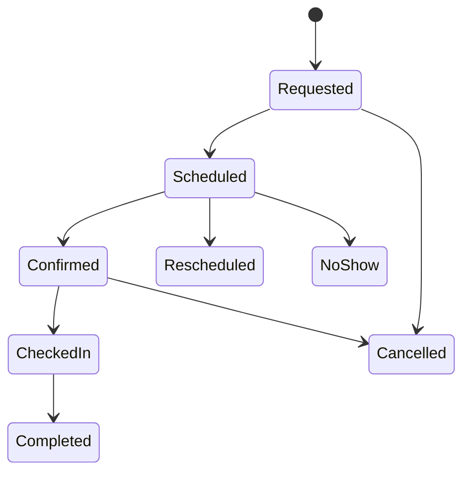
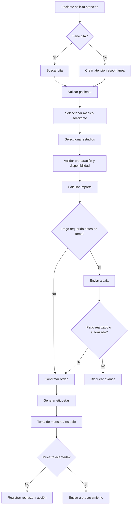

# CAP-006 — Orders, Appointments & Sample Collection

## 1. Propósito

Esta capacidad administra el flujo operativo que convierte la intención de atención de un paciente en una **orden diagnóstica ejecutable**, coordinando agenda, médico solicitante, estudios configurados, precios, preparación del paciente, toma de muestra, etiquetas, trazabilidad y transición hacia laboratorio, imagenología, caja y resultados.

CAP-006 es una capacidad crítica porque conecta:

- CAP-001 Patient Management.
- CAP-002 Organization & Branch Management.
- CAP-003 Identity, Access & Workforce Management.
- CAP-004 Medical Staff & Referring Physicians Management.
- CAP-005 Catalog & Test Configuration Management.
- CAP-007 Cashier & Billing, pendiente de detalle.
- CAP-008 Laboratory Operations, pendiente de detalle.
- CAP-009 Results Management, pendiente de detalle.

## 2. Alcance funcional

Incluye:

- Creación de órdenes diagnósticas.
- Asociación de paciente, médico, sucursal y estudios.
- Manejo de órdenes con o sin cita previa.
- Agenda por sucursal, área, recurso, sala, equipo y técnico.
- Validación de preparación del paciente.
- Generación de etiquetas por muestra.
- Toma de muestra y trazabilidad de especímenes.
- Rechazo, recolocación o recollecta de muestras.
- Envío de muestras a laboratorio interno, maquila o imagenología.
- Estados de orden, cita, muestra y línea de estudio.
- Integración con caja para bloqueo/liberación operativa según reglas de pago.
- Integración con resultados para habilitar captura/validación posterior.

No incluye todavía:

- Procesamiento analítico dentro del laboratorio.
- Interpretación de resultados.
- Facturación fiscal final.
- Inventario detallado de reactivos.
- PACS/DICOM profundo.

## 3. Objetivos de negocio

| ID | Objetivo |
|---|---|
| OBJ-006-001 | Reducir errores en órdenes mediante selección controlada de estudios configurados. |
| OBJ-006-002 | Garantizar trazabilidad desde orden hasta muestra y resultado. |
| OBJ-006-003 | Permitir atención con cita y sin cita sin duplicar procesos. |
| OBJ-006-004 | Reducir rechazos de muestra validando preparación, contenedor y condiciones requeridas. |
| OBJ-006-005 | Habilitar operación multisucursal con permisos y reglas por laboratorio. |

## 4. Roles participantes

- Paciente.
- Recepcionista.
- Cajero.
- Flebotomista / Técnico de toma de muestra.
- Técnico de imagenología.
- Químico responsable.
- Médico solicitante.
- Supervisor de sucursal.
- Administrador de laboratorio.
- Sistema de IA asistiva.
- Equipo externo/LIS/PACS, cuando aplique.

## 5. Reglas de negocio

| ID | Regla | Prioridad |
|---|---|---|
| BR-006-001 | Toda orden debe pertenecer a un laboratorio, una sucursal y un paciente activo. | Alta |
| BR-006-002 | Una orden puede crearse con o sin cita previa. | Alta |
| BR-006-003 | Una orden no puede enviarse a toma de muestra si contiene estudios inactivos o no vigentes. | Alta |
| BR-006-004 | Si el estudio requiere preparación, el sistema debe mostrarla antes de confirmar la orden. | Alta |
| BR-006-005 | Si el estudio requiere ayuno y el paciente declara no cumplirlo, la orden debe marcarse con advertencia o bloquearse según configuración. | Alta |
| BR-006-006 | Toda muestra debe tener identificador único, etiqueta y relación con orden, paciente y estudio. | Alta |
| BR-006-007 | Una muestra rechazada debe registrar motivo, usuario, fecha, sucursal y acción posterior. | Alta |
| BR-006-008 | Las órdenes canceladas no deben permitir nuevas muestras ni resultados. | Alta |
| BR-006-009 | Las órdenes con pago obligatorio no pueden avanzar a procesamiento si no están pagadas, salvo autorización. | Alta |
| BR-006-010 | La agenda debe validar disponibilidad de sucursal, recurso, sala, equipo y duración configurada. | Media |
| BR-006-011 | Los cambios de estado deben generar eventos de dominio auditables. | Alta |
| BR-006-012 | Los usuarios solo pueden operar órdenes de laboratorios/sucursales permitidos por IAM. | Alta |
| BR-006-013 | Las etiquetas deben poder reimprimirse, registrando auditoría de reimpresión. | Media |
| BR-006-014 | Una orden puede contener estudios de laboratorio e imagenología si el laboratorio lo permite. | Media |
| BR-006-015 | La toma de muestra debe poder operar en modo degradado si el servicio de IA no está disponible. | Alta |

## 6. Tablas de decisión

### 6.1 Avance de orden según pago

| Pago requerido | Pago realizado | Autorización supervisor | Resultado |
|---|---|---|---|
| No | No | No | Permitir toma de muestra |
| Sí | Sí | No | Permitir toma de muestra |
| Sí | No | Sí | Permitir con excepción auditada |
| Sí | No | No | Bloquear avance |

### 6.2 Preparación del paciente

| Requiere preparación | Paciente confirma cumplimiento | Política del estudio | Resultado |
|---|---|---|---|
| No | N/A | N/A | Continuar |
| Sí | Sí | Informativa | Continuar |
| Sí | No | Advertencia | Continuar con alerta |
| Sí | No | Bloqueante | Reprogramar o cancelar estudio |

### 6.3 Rechazo de muestra

| Motivo | Muestra disponible | Recolección posible | Resultado |
|---|---|---|---|
| Hemólisis | Sí | Sí | Recolectar nueva muestra |
| Contenedor incorrecto | Sí | Sí | Recolectar nueva muestra |
| Muestra insuficiente | Sí | Sí | Recolectar nueva muestra |
| Paciente no localizable | No | No | Orden en seguimiento |
| Error de identificación | Sí | Sí | Bloquear muestra y escalar |

## 7. Máquinas de estado

### 7.1 Estado de orden

### 7.2 Estado de muestra

### 7.3 Estado de cita

## 8. BPMN textual

## 9. Event Storming

| Evento | Descripción |
|---|---|
| AppointmentRequested | Se solicita una cita. |
| AppointmentScheduled | Se agenda una cita. |
| PatientCheckedIn | El paciente llega a sucursal. |
| DiagnosticOrderDrafted | Se inicia una orden. |
| DiagnosticOrderConfirmed | La orden queda confirmada. |
| OrderPaymentRequired | La orden requiere pago. |
| OrderPaymentCleared | La orden puede avanzar operativamente. |
| SampleLabelsGenerated | Se generan etiquetas. |
| SampleCollected | Se toma una muestra. |
| SampleRejected | Se rechaza una muestra. |
| SampleRecollectionRequested | Se solicita nueva toma. |
| SampleReceivedByLab | Laboratorio recibe la muestra. |
| OrderReadyForProcessing | La orden puede avanzar a laboratorio/resultados. |
| OrderCancelled | La orden se cancela. |

## 10. Modelo DDD

### Agregados

- DiagnosticOrder.
- Appointment.
- Sample.
- OrderLine.
- CollectionSession.

### Entidades

- DiagnosticOrder.
- DiagnosticOrderLine.
- Appointment.
- Sample.
- SampleContainer.
- SampleLabel.
- SampleRejection.
- CollectionInstruction.
- CollectionSite.
- ResourceSchedule.
- OrderAuthorization.

### Value Objects

- OrderNumber.
- AppointmentSlot.
- SampleCode.
- PreparationStatus.
- PaymentClearanceStatus.
- CollectionPriority.
- TestPreparationRequirement.
- ScheduleAvailability.

### Servicios de dominio

- OrderCreationPolicy.
- AppointmentSchedulingPolicy.
- SampleCollectionPolicy.
- PreparationValidationService.
- PaymentClearancePolicy.
- LabelGenerationService.

## 11. Commands & Queries

### Commands

- CreateDiagnosticOrder.
- ConfirmDiagnosticOrder.
- CancelDiagnosticOrder.
- ScheduleAppointment.
- RescheduleAppointment.
- CheckInPatient.
- GenerateSampleLabels.
- RegisterSampleCollection.
- RejectSample.
- RequestSampleRecollection.
- ReceiveSampleInLab.
- AuthorizeOrderProgression.

### Queries

- GetOrderById.
- SearchOrders.
- GetPatientOrders.
- GetAppointmentAvailability.
- GetDailyAppointments.
- GetPendingCollections.
- GetSampleTraceability.
- GetOrderTimeline.

## 12. Historias de usuario iniciales

| ID | Historia | Prioridad |
|---|---|---|
| US-006-001 | Como recepcionista, quiero crear una orden para un paciente activo seleccionando estudios vigentes para iniciar el flujo diagnóstico. | Alta |
| US-006-002 | Como recepcionista, quiero crear una orden sin cita previa para atender pacientes walk-in. | Alta |
| US-006-003 | Como recepcionista, quiero asociar un médico solicitante a la orden para mantener trazabilidad clínica y comercial. | Alta |
| US-006-004 | Como recepcionista, quiero visualizar preparación requerida antes de confirmar la orden para informar al paciente. | Alta |
| US-006-005 | Como cajero, quiero saber si una orden requiere pago antes de toma para controlar el avance operativo. | Alta |
| US-006-006 | Como flebotomista, quiero ver mis tomas pendientes por sucursal para organizar mi trabajo. | Alta |
| US-006-007 | Como flebotomista, quiero registrar una muestra tomada con contenedor y hora para garantizar trazabilidad. | Alta |
| US-006-008 | Como técnico, quiero rechazar una muestra con motivo controlado para solicitar recollecta o escalar el caso. | Alta |
| US-006-009 | Como supervisor, quiero autorizar avance sin pago en casos excepcionales con auditoría. | Media |
| US-006-010 | Como paciente, quiero recibir confirmación de mi cita y preparación para asistir correctamente. | Media |
| US-006-011 | Como administrador, quiero configurar disponibilidad por sucursal/recurso para controlar agenda. | Media |
| US-006-012 | Como laboratorio, quiero imprimir y reimprimir etiquetas registrando auditoría. | Alta |
| US-006-013 | Como usuario autorizado, quiero consultar la línea de tiempo de la orden para revisar todo lo sucedido. | Alta |
| US-006-014 | Como sistema externo, quiero consultar el estado de una orden mediante API segura. | Media |
| US-006-015 | Como agente de IA, quiero sugerir preparación faltante al recepcionista sin bloquear la operación si IA no está disponible. | Media |

## 13. OpenAPI scope

Contratos iniciales:

- `05-contracts/contracts/openapi/orders/orders.openapi.md`.
- `05-contracts/contracts/openapi/appointments/appointments.openapi.md`.
- `05-contracts/contracts/openapi/samples/samples.openapi.md`.

Endpoints iniciales:

- `POST /orders`.
- `GET /orders/{orderId}`.
- `POST /orders/{orderId}/confirm`.
- `POST /orders/{orderId}/cancel`.
- `GET /orders/{orderId}/timeline`.
- `POST /appointments`.
- `GET /appointments/availability`.
- `POST /appointments/{appointmentId}/check-in`.
- `POST /orders/{orderId}/labels`.
- `POST /samples/{sampleId}/collect`.
- `POST /samples/{sampleId}/reject`.
- `GET /samples/{sampleId}/traceability`.

## 14. UI Web

Pantallas MVP:

- Búsqueda/selección de paciente.
- Creación de orden.
- Selección de estudios.
- Validación de preparación.
- Resumen de orden e importe.
- Agenda y disponibilidad.
- Cola de toma de muestra.
- Registro de toma.
- Rechazo de muestra.
- Timeline de orden.

Lineamientos:

- Debe funcionar en navegadores comerciales modernos sin depender de características experimentales.
- Debe operar con formularios simples, validaciones claras y navegación rápida.
- Debe tener fallback sin IA para todo flujo crítico.

## 15. Mobile

Pantallas MVP:

- Lista de citas del paciente.
- Preparación para estudios.
- Check-in básico mediante QR o código.
- Cola de muestras para técnico.
- Registro simple de muestra.
- Confirmación de cita.

Lineamientos:

- Compatible con dispositivos Android/iOS de gama baja razonablemente soportados.
- Sin animaciones pesadas en procesos críticos.
- Sin dependencia de IA local.
- Capacidad de operar formularios críticos con baja conectividad cuando sea viable.

## 16. IA

Casos de uso:

- Sugerir preparación del paciente con lenguaje simple.
- Detectar inconsistencias entre estudios y datos del paciente.
- Asistir al recepcionista con resumen de orden.
- Recomendar duración estimada de cita.
- Identificar posibles duplicados de orden.

Guardrails:

- La IA no confirma órdenes automáticamente.
- La IA no modifica estudios sin aprobación humana.
- La IA no desbloquea pagos ni autorizaciones.
- Todo resultado de IA debe ser explicable y auditable cuando afecte operación.

## 17. QA y pruebas

Tipos de prueba:

- Contract tests contra OpenAPI.
- Unit tests de políticas de dominio.
- Integration tests de flujo orden → muestra.
- E2E de creación de orden walk-in.
- E2E de agenda con cita.
- Security tests de permisos por sucursal.
- Performance tests para búsqueda de órdenes y cola de toma.

## 18. KPIs

- Tiempo promedio de creación de orden.
- Porcentaje de órdenes con preparación incompleta.
- Tasa de rechazo de muestras.
- Tiempo entre check-in y toma de muestra.
- Tiempo entre muestra tomada y recepción por laboratorio.
- Porcentaje de reimpresiones de etiqueta.
- Órdenes bloqueadas por pago.

## 19. Compliance

- Auditoría de creación, modificación, cancelación y autorización.
- Trazabilidad completa de muestra.
- Separación de permisos por laboratorio/sucursal.
- Protección de datos personales y clínicos.
- Retención configurable por country pack.

## 20. Trazabilidad

CAP-006 depende de:

- CAP-001 Pacientes.
- CAP-002 Organización y sucursales.
- CAP-003 IAM.
- CAP-004 Médicos.
- CAP-005 Configuración de pruebas.

CAP-006 habilita:

- CAP-007 Caja.
- CAP-008 Operación de laboratorio.
- CAP-009 Resultados.
- CAP-010 Facturación.
- CAP-011 Portal paciente.
- CAP-012 Portal médico.
