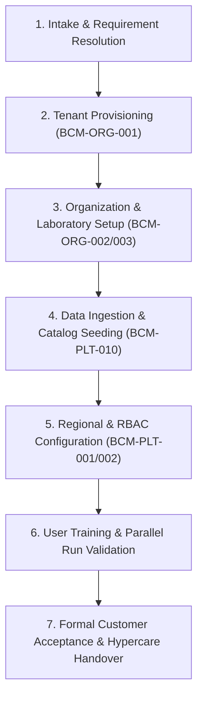

# Customer & Tenant Onboarding Guide

## Overview

This guide establishes the standard, agent-agnostic operational procedure for onboarding new healthcare organizations and commercial tenants onto the **Healthcare Operations Platform (HOP)**.

## Onboarding Lifecycle Stages



## Stage 1: Customer Intake & Isolation Strategy Selection

Before calling tenant management APIs, the deployment team must determine:
1. **Tenant Identification**:
   - `code`: Unique alphanumeric identifier (e.g., `CLINICA-SAN-JOSE`).
   - `legalName`: Registered commercial legal entity name.
   - `tradeName`: Brand or operating name.
   - `taxId`: Official country tax identification code (e.g., RFC in Mexico).
2. **Commercial Tier**:
   - `COMMERCIAL_STANDARD`: Standard cloud multi-tenant tier.
   - `COMMERCIAL_ENTERPRISE`: Dedicated enterprise tier with custom limits and SLA.
3. **Database Isolation Strategy**:
   - `DIS_SHARED_SCHEMA`: Shared schema with mandatory `tenant_id` column filtering.
   - `DIS_SCHEMA_PER_TENANT`: Isolated database schema per tenant.
   - `DIS_DATABASE_PER_TENANT`: Fully isolated database instance.

## Stage 2: Executing Tenant Provisioning

Tenant provisioning is executed via the `BCM-ORG-001` Tenant Management service endpoint:

```http
POST /api/platform/tenants
Content-Type: application/json
X-Tenant-ID: platform-admin

{
  "code": "CLINICA-SAN-JOSE",
  "name": "Clínica Diagnóstica San José",
  "legalName": "Clínica Diagnóstica San José S.A. de C.V.",
  "tradeName": "Laboratorios San José",
  "taxId": "CSJ920415XYZ",
  "tier": "COMMERCIAL_STANDARD",
  "isolationStrategy": "DIS_SHARED_SCHEMA"
}
```

### Verification & Audit Evidence
Upon successful invocation:
1. Response returns `201 Created` with tenant status `ACTIVE`.
2. An append-only audit event (`BCM-PLT-007`) is recorded with `action=PROVISION_TENANT` and `aggregateType=Tenant`.

## Stage 3: Tenant Lifecycle Management & Status Transitions

Tenants transition through controlled operational states:
- **`ACTIVE`**: Fully operational tenant.
- **`SUSPENDED`**: Access temporarily blocked for billing or compliance reasons; patient/clinical data remains immutable.
- **`TERMINATED`**: Customer offboarded; data retained per statutory retention policy (`BCM-PLT-008`).

```http
PUT /api/platform/tenants/CLINICA-SAN-JOSE/status
Content-Type: application/json
X-Tenant-ID: platform-admin

{
  "status": "SUSPENDED",
  "reason": "Scheduled system maintenance and data audit"
}
```
