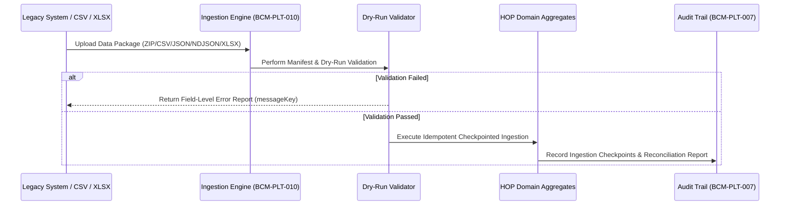

# Data Migration & Initial Ingestion Checklist

## Overview

This checklist establishes the data migration and initial ingestion protocol adhering to the **HOP Open Data Ingestion Standard** (`BCM-PLT-010`) for importing legacy patient records, diagnostic test catalogs, medical doctor directories, and initial inventory stock into **Healthcare Operations Platform (HOP)**.

## Architectural Data Ingestion Flow



## Mandatory Ingestion Entity Sequence

To preserve entity integrity and foreign key relationships, initial data ingestion MUST be executed in the strict order specified below:

1. **Category 1: Master Reference Data**:
   - Countries, states, cities, postal codes, currencies, locales.
2. **Category 2: Organization & Branch Structure**:
   - Organization details, primary laboratory, branch offices, collection points.
3. **Category 3: User Accounts & Doctors Directory**:
   - System users (`BCM-PLT-001`), referring doctor directory (`BCM-PER-003`).
4. **Category 4: Diagnostic Catalog (`BCM-SVC-001..009`)**:
   - Diagnostic services, test definitions, analytes, reference ranges, panels, preparations, price lists.
5. **Category 5: Patient Master Index (`BCM-PER-001/002`)**:
   - Patient profiles, natural key identifiers (national identity, tax ID, medical record number), contact details.
6. **Category 6: Inventory Baseline (`BCM-INV-001..009`)**:
   - Products, reagents, stock lots, initial warehouse balance entries.
7. **Category 7: Historical Diagnostic Results (Optional)**:
   - Historical diagnostic orders and released result reports (read-only snapshots).

## Supported File Formats & Multi-Format Parsing

HOP supports standard, vendor-agnostic import file formats:
- **`CSV`**: Comma-separated values with UTF-8 header.
- **`JSON` / `NDJSON`**: Structured JSON array or newline-delimited JSON objects.
- **`ZIP`**: Compressed package containing data files plus `manifest.json`.
- **`XLSX`**: Microsoft Excel spreadsheets parsed via Apache POI adapter.

## Ingestion Job Lifecycle & Checkpoint Protocol

Data ingestion jobs (`MigrationJob` / `AGG-016`) progress through strict state transitions:

```http
POST /api/migration/jobs
Content-Type: multipart/form-data
X-Tenant-ID: CLINICA-SAN-JOSE

--file=catalog_import_v1.zip
--dryRun=true
```

### State Transitions:
1. **`SUBMITTED`**: Data package received and manifest checksum validated (`SHA-256`).
2. **`VALIDATING`**: Executing schema validation and natural key duplicate checks without mutating database.
3. **`DRY_RUN_COMPLETED`**: Validation report generated with zero errors.
4. **`COMMITTING`**: Idempotent checkpointed import executing sequentially by entity category.
5. **`COMPLETED`**: All records committed; post-import reconciliation report generated.

## Verification & Pre-Go-Live Reconciliation Checklist

- [ ] File package contains valid `manifest.json` with file checksums.
- [ ] Dry-run executed clean with zero unhandled validation errors.
- [ ] Patient duplicate detection dry-run evaluated against configurable matching thresholds (`BCM-PER-002`).
- [ ] Post-import reconciliation report confirms row count parity between source export and HOP imported aggregates.
- [ ] Pre-go-live sample verification: 50 randomly sampled patient records and 20 test catalog entries manually cross-verified.
