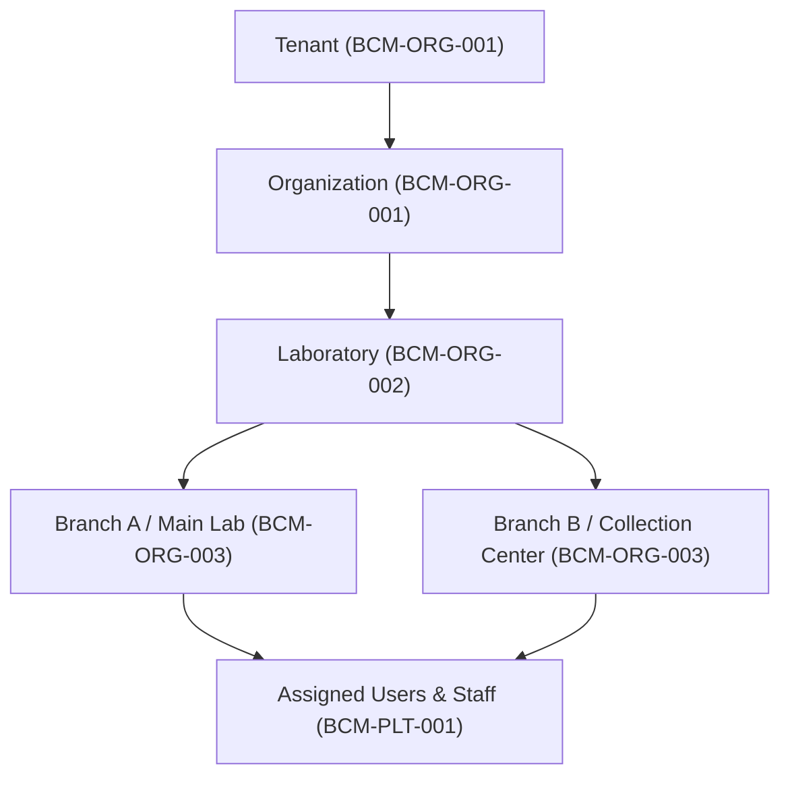

# Initial Organization & Laboratory Configuration Guide

## Overview

This guide details the procedure for setting up an organization's master structures, primary laboratory unit, branch networks, user accounts, and diagnostic catalog baseline within **Healthcare Operations Platform (HOP)**.

## Architectural Entity Hierarchy



## Step 1: Organization & Primary Laboratory Registration

1. **Organization Registration (`BCM-ORG-001`)**:
   - Establish company profile, address, contact details, official license numbers.
2. **Laboratory Registration (`BCM-ORG-002`)**:
   - Register central diagnostic laboratory details, sanitary permit numbers, responsible medical director credentials, and operational license keys.

```http
POST /api/organization/laboratories
Content-Type: application/json
X-Tenant-ID: CLINICA-SAN-JOSE

{
  "code": "LAB-CENTRAL",
  "name": "Laboratorio Central San José",
  "sanitaryLicense": "SL-MX-2026-00891",
  "medicalDirector": "Dr. Roberto Gómez Monteverde",
  "directorLicense": "CED-PROF-8841029",
  "status": "ACTIVE"
}
```

## Step 2: Branch Network Configuration (`BCM-ORG-003`)

Register processing labs and specimen collection centers:
- **`BRANCH_LABORATORY`**: Main processing lab equipped with analyzers and validation staff.
- **`BRANCH_COLLECTION_POINT`**: Outpatient collection kiosk/branch for sample collection and patient registration only.

```http
POST /api/organization/branches
Content-Type: application/json
X-Tenant-ID: CLINICA-SAN-JOSE

{
  "code": "SUC-NORTE",
  "name": "Sucursal Norte - Centro de Toma",
  "branchType": "BRANCH_COLLECTION_POINT",
  "address": {
    "street": "Av. Insurgentes Norte 1400",
    "city": "Ciudad de México",
    "state": "CDMX",
    "countryCode": "MEX",
    "postalCode": "07300"
  },
  "phone": "+525555550199",
  "status": "ACTIVE"
}
```

## Step 3: Initial Staff & User Provisioning (`BCM-PLT-001`)

Provision initial administrative, technical, and clinical accounts:

```http
POST /api/iam/users
Content-Type: application/json
X-Tenant-ID: CLINICA-SAN-JOSE

{
  "username": "lab.tech.01",
  "email": "tech01@labsanjose.com",
  "firstName": "Maria",
  "lastName": "Hernandez",
  "roles": ["LAB_TECH"],
  "branchAssignments": ["SUC-NORTE", "LAB-CENTRAL"],
  "defaultLocale": "es-MX"
}
```

## Step 4: Diagnostic Catalog Baseline Setup

Seed the diagnostic test catalog baseline using `BCM-SVC-001` through `BCM-SVC-009`:
1. **Diagnostic Services**: Groupings such as Clinical Chemistry, Hematology, Microbiology.
2. **Individual Tests & Analytes**: Test definitions, measurement units, reference intervals by sex/age.
3. **Panels & Bundles**: Groupings like Basic Metabolic Panel or Complete Blood Count.
4. **Patient Preparations**: Fasting instructions, sample collection protocols.
5. **Price Lists**: Effective-dated price structures per branch and client type.
