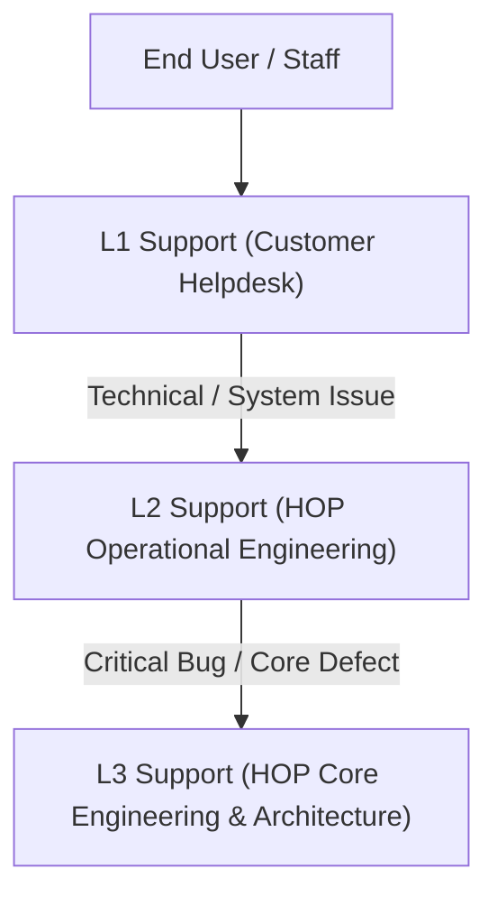

# Support, Escalation & Initial Operations Guide

## Overview

This guide defines the support tier structure, incident response SLA matrix, escalation procedures, observability monitoring, backup routines, and initial 30-day hypercare operational model for **Healthcare Operations Platform (HOP)**.

## Support Tier Architecture

1. **L1 Support (Customer Helpdesk / On-site Administrator)**:
   - Initial triage, user password resets, workstation/printer connection issues, basic workflow guidance.
2. **L2 Support (HOP Operational Support Engineering)**:
   - System configuration, integration troubleshooting, data ingestion job failures, API rate-limit policies, database performance queries.
3. **L3 Support (HOP Core Product Engineering)**:
   - Core platform defects, security vulnerabilities, database migration defects, critical uptime incidents.

## Incident Severity & Response SLA Matrix

| Severity Level | Definition / Impact | Target Response Time | Target Resolution Time | Escalation Path |
|---|---|---|---|---|
| **P1 - Critical** | Complete platform outage, database corruption, unable to process orders or release diagnostic results | < 15 Minutes | < 2 Hours | Immediate page to L2/L3 Lead & Engineering Management |
| **P2 - High** | Major feature unavailable (e.g., billing adapter failing, result report generation blocked for one branch) | < 1 Hour | < 8 Hours | L2 Support Lead notify L3 Lead within 2 hours |
| **P3 - Medium** | Non-critical functionality defect with viable workaround available (e.g., UI display glitch) | < 4 Hours | < 48 Hours | Standard ticketing queue to L2 |
| **P4 - Low** | Minor feature request, documentation clarification, cosmetic UI feedback | < 24 Hours | Next Release Cycle | Backlog prioritization review |

## Observability & System Health Monitoring

Operational teams must monitor system health using built-in Prometheus metrics and health endpoints (`BCM-PLT-006`):
- **Health Probes**:
  - `GET /actuator/health/liveness`: Returns `200 UP` if container application is alive.
  - `GET /actuator/health/readiness`: Returns `200 UP` if database and active adapters are connected.
- **Prometheus Metrics**:
  - `GET /actuator/prometheus`: Exposes JVM heap, HTTP response latencies, active database connection pool stats, error rates.

## Backup & Disaster Recovery Operations

1. **Database Backups**:
   - Automated daily full dump via `pg_dump` with SHA-256 integrity verification.
   - WAL archiving enabled for point-in-time recovery (PITR).
2. **Restore Rehearsal**:
   - Monthly restore rehearsal to an isolated test environment verifying row count parity and TOC checksums.

## Initial 30-Day Hypercare Protocol

During the first 30 days post-go-live:
1. **Dedicated Support Engineer**: Assigned L2 engineer monitoring customer tenant metrics daily.
2. **Daily Standup Call**: 15-minute daily sync between customer project manager and HOP enablement team.
3. **Weekly Operational Review**: Review ticket volume, system performance, user adoption, and open feedback.
4. **Transition to Standard Support**: Formal sign-off transitioning customer from Hypercare to standard SLA support at Day 30.
