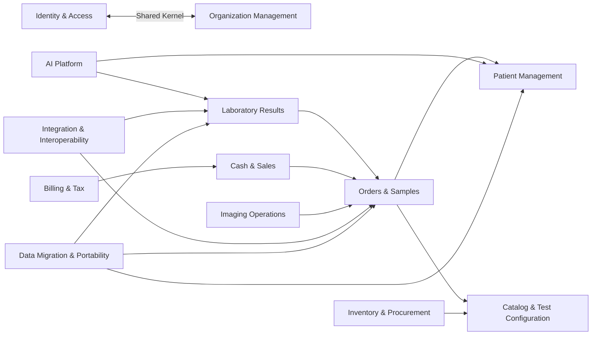

# Generated Context Map

> Generated from `02-domain-definition/domain-foundation/context-map/context-map.md`.

This generated artifact summarizes the official context relationships. Do not edit manually.

## High-Level Flow

